内容来源：[Tutorial/xtuner/personal_assistant_document.md at camp2 · InternLM/Tutorial · GitHub**LLM Tutorial. Contribute to InternLM/Tutorial development by creating an account on GitHub.**https://github.com/InternLM/Tutorial/blob/camp2/xtuner/personal_assistant_document.md](https://github.com/InternLM/Tutorial/blob/camp2/xtuner/personal_assistant_document.md "Tutorial/xtuner/personal_assistant_document.md at camp2 · InternLM/Tutorial · GitHub")

# Xtuner运行原理：

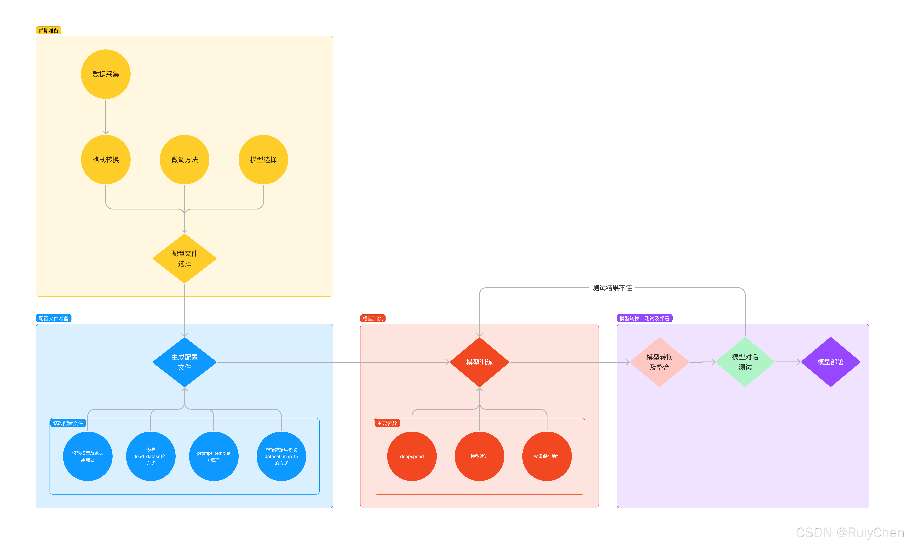
黄色表示：数据处理、微调方法选择如lora，LLM选择

蓝色表示：xtuner根据选择的数据自动加载数据，根据LLM选择相应的prompt_templat，自动做数据映射。处理完的数据可以直接输入模型训练

红色表示：模型训练 使用deepspeed加速（自己配置挺麻烦的），支持中断后继续训练，并且保存checkpoints

紫色表示：整合微调的权重和LLMs，部署LLM


总的来说 xtuner是一个便捷的llm微调测试工具。

# 微调实战：

按照教程来，一路都很丝滑

## 环境

```bash
# 如果你是在 InternStudio 平台，则从本地 clone 一个已有 pytorch 的环境：
# pytorch    2.0.1   py3.10_cuda11.7_cudnn8.5.0_0

studio-conda xtuner0.1.17
# 如果你是在其他平台：
# conda create --name xtuner0.1.17 python=3.10 -y

# 激活环境
conda activate xtuner0.1.17
# 进入家目录 （~的意思是 “当前用户的home路径”）
cd ~
# 创建版本文件夹并进入，以跟随本教程
mkdir -p /root/xtuner0117 && cd /root/xtuner0117

# 拉取 0.1.17 的版本源码
git clone -b v0.1.17  https://github.com/InternLM/xtuner
# 无法访问github的用户请从 gitee 拉取:
# git clone -b v0.1.15 https://gitee.com/Internlm/xtuner

# 进入源码目录
cd /root/xtuner0117/xtuner

# 从源码安装 XTuner
pip install -e '.[all]' -i https://mirrors.aliyun.com/pypi/simple/
```
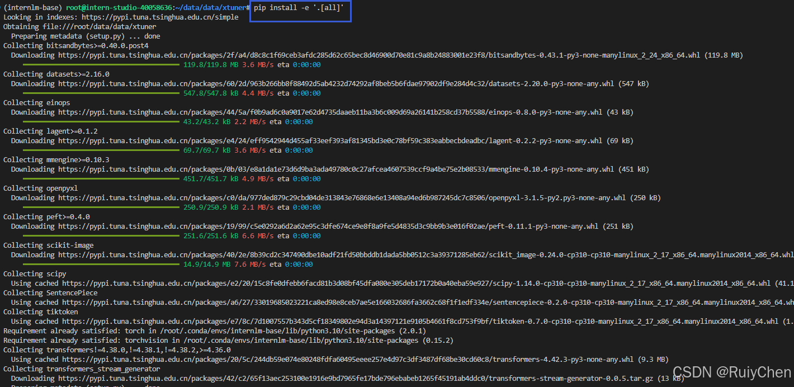

### 2.2 前期准备

#### 2.2.1 数据集准备

```bash
# 前半部分是创建一个文件夹，后半部分是进入该文件夹。
mkdir -p /root/ft && cd /root/ft

# 在ft这个文件夹里再创建一个存放数据的data文件夹
mkdir -p /root/ft/data && cd /root/ft/data

# 创建 `generate_data.py` 文件
touch /root/ft/data/generate_data.py
```

```python
import json

# 设置用户的名字
name = '陈陈陈陈Aorg'
# 设置需要重复添加的数据次数
n =  10000

# 初始化OpenAI格式的数据结构
data = [
    {
        "messages": [
            {
                "role": "user",
                "content": "请做一下自我介绍"
            },
            {
                "role": "assistant",
                "content": "我是{}的小助手，内在是上海AI实验室书生·浦语的1.8B大模型哦".format(name)
            }
        ]
    }
]

# 通过循环，将初始化的对话数据重复添加到data列表中
for i in range(n):
    data.append(data[0])

# 将data列表中的数据写入到一个名为'personal_assistant.json'的文件中
with open('personal_assistant.json', 'w', encoding='utf-8') as f:
    # 使用json.dump方法将数据以JSON格式写入文件
    # ensure_ascii=False 确保中文字符正常显示
    # indent=4 使得文件内容格式化，便于阅读
    json.dump(data, f, ensure_ascii=False, indent=4)
```


name="" 改为自己的名字

运行：

```bash
# 确保先进入该文件夹
cd /root/ft/data

# 运行代码
python /root/ft/data/generate_data.py
```

生成训练数据集：


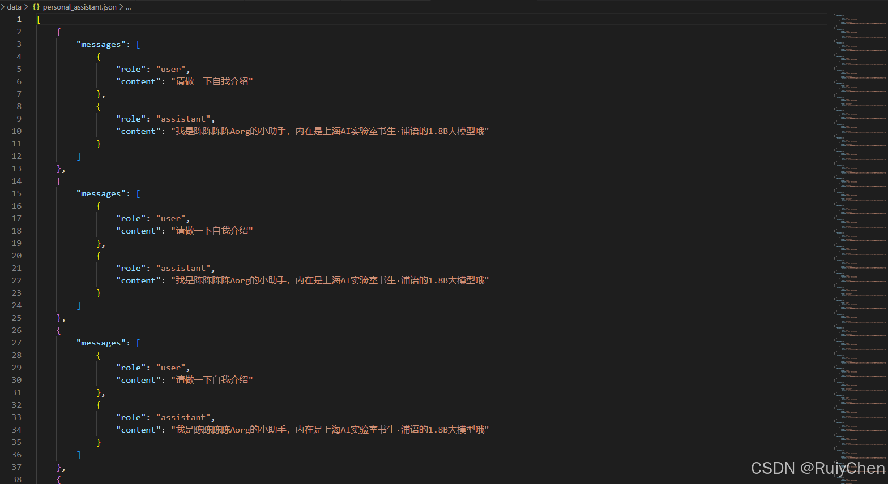

#### 2.2.2 模型准备

对于在 InternStudio 上运行的小伙伴们，可以不用通过 OpenXLab 或者 Modelscope 进行模型的下载。我们直接通过以下代码一键创建文件夹并将所有文件复制进去。

```bash
# 创建目标文件夹，确保它存在。
# -p选项意味着如果上级目录不存在也会一并创建，且如果目标文件夹已存在则不会报错。
mkdir -p /root/ft/model

# 复制内容到目标文件夹。-r选项表示递归复制整个文件夹。
cp -r /root/share/new_models/Shanghai_AI_Laboratory/internlm2-chat-1_8b/* /root/ft/model/
```

假如大家存储空间不足，我们也可以通过以下代码一键通过符号链接的方式链接到模型文件，这样既节省了空间，也便于管理。

```bash
# 删除/root/ft/model目录
rm -rf /root/ft/model

# 创建符号链接
ln -s /root/share/new_models/Shanghai_AI_Laboratory/internlm2-chat-1_8b /root/ft/model
```


 输入Xtuner 有详细的执行命令教程
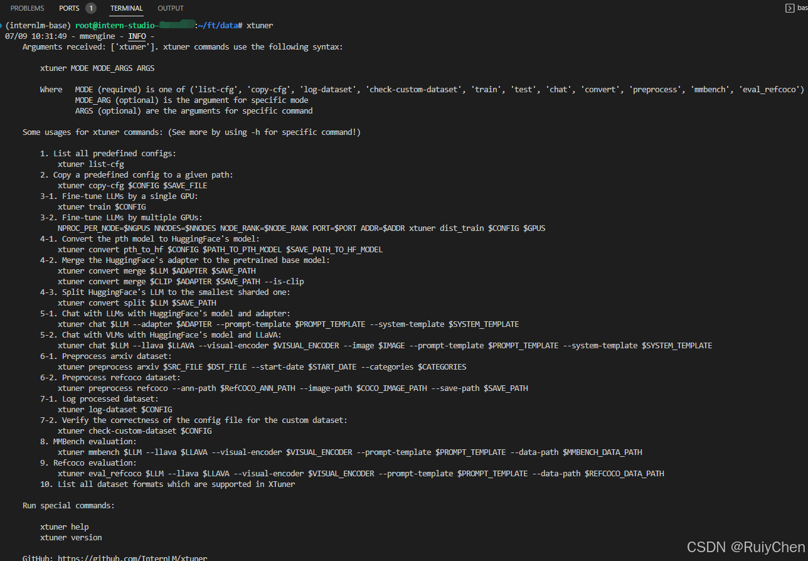

```bash
# 列出所有内置配置文件
# xtuner list-cfg

# 假如我们想找到 internlm2-1.8b 模型里支持的配置文件
xtuner list-cfg -p internlm2_1_8b
```


```bash
# 创建一个存放 config 文件的文件夹
mkdir -p /root/ft/config

# 使用 XTuner 中的 copy-cfg 功能将 config 文件复制到指定的位置
xtuner copy-cfg internlm2_1_8b_qlora_alpaca_e3 /root/ft/config
```
 操作完，文件列表：
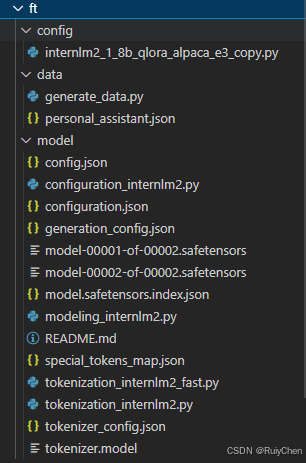

#### 2.3 配置文件修改

假如我们真的打开配置文件后，我们可以看到整体的配置文件分为五部分：

1. **PART 1 Settings** ：涵盖了模型基本设置，如预训练模型的选择、数据集信息和训练过程中的一些基本参数（如批大小、学习率等）。
2. **PART 2 Model & Tokenizer** ：指定了用于训练的模型和分词器的具体类型及其配置，包括预训练模型的路径和是否启用特定功能（如可变长度注意力），这是模型训练的核心组成部分。
3. **PART 3 Dataset & Dataloader** ：描述了数据处理的细节，包括如何加载数据集、预处理步骤、批处理大小等，确保了模型能够接收到正确格式和质量的数据。
4. **PART 4 Scheduler & Optimizer** ：配置了优化过程中的关键参数，如学习率调度策略和优化器的选择，这些是影响模型训练效果和速度的重要因素。
5. **PART 5 Runtime** ：定义了训练过程中的额外设置，如日志记录、模型保存策略和自定义钩子等，以支持训练流程的监控、调试和结果的保存。

将config下的文件修改参数

模型位置，数据位置，测评问题等：

```python
# Copyright (c) OpenMMLab. All rights reserved.
import torch
from datasets import load_dataset
from mmengine.dataset import DefaultSampler
from mmengine.hooks import (CheckpointHook, DistSamplerSeedHook, IterTimerHook,
                            LoggerHook, ParamSchedulerHook)
from mmengine.optim import AmpOptimWrapper, CosineAnnealingLR, LinearLR
from peft import LoraConfig
from torch.optim import AdamW
from transformers import (AutoModelForCausalLM, AutoTokenizer,
                          BitsAndBytesConfig)

from xtuner.dataset import process_hf_dataset
from xtuner.dataset.collate_fns import default_collate_fn
from xtuner.dataset.map_fns import openai_map_fn, template_map_fn_factory
from xtuner.engine.hooks import (DatasetInfoHook, EvaluateChatHook,
                                 VarlenAttnArgsToMessageHubHook)
from xtuner.engine.runner import TrainLoop
from xtuner.model import SupervisedFinetune
from xtuner.parallel.sequence import SequenceParallelSampler
from xtuner.utils import PROMPT_TEMPLATE, SYSTEM_TEMPLATE

#######################################################################
#                          PART 1  Settings                           #
#######################################################################
# Model
pretrained_model_name_or_path = '/root/ft/model'
use_varlen_attn = False

# Data
alpaca_en_path = '/root/ft/data/personal_assistant.json'
prompt_template = PROMPT_TEMPLATE.internlm2_chat
max_length = 1024
pack_to_max_length = True

# parallel
sequence_parallel_size = 1

# Scheduler & Optimizer
batch_size = 1  # per_device
accumulative_counts = 16
accumulative_counts *= sequence_parallel_size
dataloader_num_workers = 0
max_epochs = 2
optim_type = AdamW
lr = 2e-4
betas = (0.9, 0.999)
weight_decay = 0
max_norm = 1  # grad clip
warmup_ratio = 0.03

# Save
save_steps = 300
save_total_limit = 3  # Maximum checkpoints to keep (-1 means unlimited)

# Evaluate the generation performance during the training
evaluation_freq = 300
SYSTEM = ''
evaluation_inputs = ['请你介绍一下你自己', '你是谁', '你是我的小助手吗']

#######################################################################
#                      PART 2  Model & Tokenizer                      #
#######################################################################
tokenizer = dict(
    type=AutoTokenizer.from_pretrained,
    pretrained_model_name_or_path=pretrained_model_name_or_path,
    trust_remote_code=True,
    padding_side='right')

model = dict(
    type=SupervisedFinetune,
    use_varlen_attn=use_varlen_attn,
    llm=dict(
        type=AutoModelForCausalLM.from_pretrained,
        pretrained_model_name_or_path=pretrained_model_name_or_path,
        trust_remote_code=True,
        torch_dtype=torch.float16,
        quantization_config=dict(
            type=BitsAndBytesConfig,
            load_in_4bit=True,
            load_in_8bit=False,
            llm_int8_threshold=6.0,
            llm_int8_has_fp16_weight=False,
            bnb_4bit_compute_dtype=torch.float16,
            bnb_4bit_use_double_quant=True,
            bnb_4bit_quant_type='nf4')),
    lora=dict(
        type=LoraConfig,
        r=64,
        lora_alpha=16,
        lora_dropout=0.1,
        bias='none',
        task_type='CAUSAL_LM'))

#######################################################################
#                      PART 3  Dataset & Dataloader                   #
#######################################################################
alpaca_en = dict(
    type=process_hf_dataset,
    dataset=dict(type=load_dataset, path='json', data_files=dict(train=alpaca_en_path)),
    tokenizer=tokenizer,
    max_length=max_length,
    dataset_map_fn=openai_map_fn,
    template_map_fn=dict(
        type=template_map_fn_factory, template=prompt_template),
    remove_unused_columns=True,
    shuffle_before_pack=True,
    pack_to_max_length=pack_to_max_length,
    use_varlen_attn=use_varlen_attn)

sampler = SequenceParallelSampler \
    if sequence_parallel_size > 1 else DefaultSampler
train_dataloader = dict(
    batch_size=batch_size,
    num_workers=dataloader_num_workers,
    dataset=alpaca_en,
    sampler=dict(type=sampler, shuffle=True),
    collate_fn=dict(type=default_collate_fn, use_varlen_attn=use_varlen_attn))

#######################################################################
#                    PART 4  Scheduler & Optimizer                    #
#######################################################################
# optimizer
optim_wrapper = dict(
    type=AmpOptimWrapper,
    optimizer=dict(
        type=optim_type, lr=lr, betas=betas, weight_decay=weight_decay),
    clip_grad=dict(max_norm=max_norm, error_if_nonfinite=False),
    accumulative_counts=accumulative_counts,
    loss_scale='dynamic',
    dtype='float16')

# learning policy
# More information: https://github.com/open-mmlab/mmengine/blob/main/docs/en/tutorials/param_scheduler.md  # noqa: E501
param_scheduler = [
    dict(
        type=LinearLR,
        start_factor=1e-5,
        by_epoch=True,
        begin=0,
        end=warmup_ratio * max_epochs,
        convert_to_iter_based=True),
    dict(
        type=CosineAnnealingLR,
        eta_min=0.0,
        by_epoch=True,
        begin=warmup_ratio * max_epochs,
        end=max_epochs,
        convert_to_iter_based=True)
]

# train, val, test setting
train_cfg = dict(type=TrainLoop, max_epochs=max_epochs)

#######################################################################
#                           PART 5  Runtime                           #
#######################################################################
# Log the dialogue periodically during the training process, optional
custom_hooks = [
    dict(type=DatasetInfoHook, tokenizer=tokenizer),
    dict(
        type=EvaluateChatHook,
        tokenizer=tokenizer,
        every_n_iters=evaluation_freq,
        evaluation_inputs=evaluation_inputs,
        system=SYSTEM,
        prompt_template=prompt_template)
]

if use_varlen_attn:
    custom_hooks += [dict(type=VarlenAttnArgsToMessageHubHook)]

# configure default hooks
default_hooks = dict(
    # record the time of every iteration.
    timer=dict(type=IterTimerHook),
    # print log every 10 iterations.
    logger=dict(type=LoggerHook, log_metric_by_epoch=False, interval=10),
    # enable the parameter scheduler.
    param_scheduler=dict(type=ParamSchedulerHook),
    # save checkpoint per `save_steps`.
    checkpoint=dict(
        type=CheckpointHook,
        by_epoch=False,
        interval=save_steps,
        max_keep_ckpts=save_total_limit),
    # set sampler seed in distributed evrionment.
    sampler_seed=dict(type=DistSamplerSeedHook),
)

# configure environment
env_cfg = dict(
    # whether to enable cudnn benchmark
    cudnn_benchmark=False,
    # set multi process parameters
    mp_cfg=dict(mp_start_method='fork', opencv_num_threads=0),
    # set distributed parameters
    dist_cfg=dict(backend='nccl'),
)

# set visualizer
visualizer = None

# set log level
log_level = 'INFO'

# load from which checkpoint
load_from = None

# whether to resume training from the loaded checkpoint
resume = False

# Defaults to use random seed and disable `deterministic`
randomness = dict(seed=None, deterministic=False)

# set log processor
log_processor = dict(by_epoch=False)
```

### 2.4 模型训练

#### 2.4.1 常规训练

当我们准备好了配置文件好，我们只需要将使用 `xtuner train` 指令即可开始训练。

我们可以通过添加 `--work-dir` 指定特定的文件保存位置，比如说就保存在 `/root/ft/train` 路径下。假如不添加的话模型训练的过程文件将默认保存在 `./work_dirs/internlm2_1_8b_qlora_alpaca_e3_copy` 的位置，就比如说我是在 `/root/ft/train` 的路径下输入该指令，那么我的文件保存的位置就是在 `/root/ft/train/work_dirs/internlm2_1_8b_qlora_alpaca_e3_copy` 的位置下。

```bash
# 指定保存路径
xtuner train /root/ft/config/internlm2_1_8b_qlora_alpaca_e3_copy.py --work-dir /root/ft/train
```

30% A100 使用情况，10G用不到：


##### 2.4.2.1evaluate 结果1


失败了 增加epoch数量到5


失败了 增加epoch数量到10

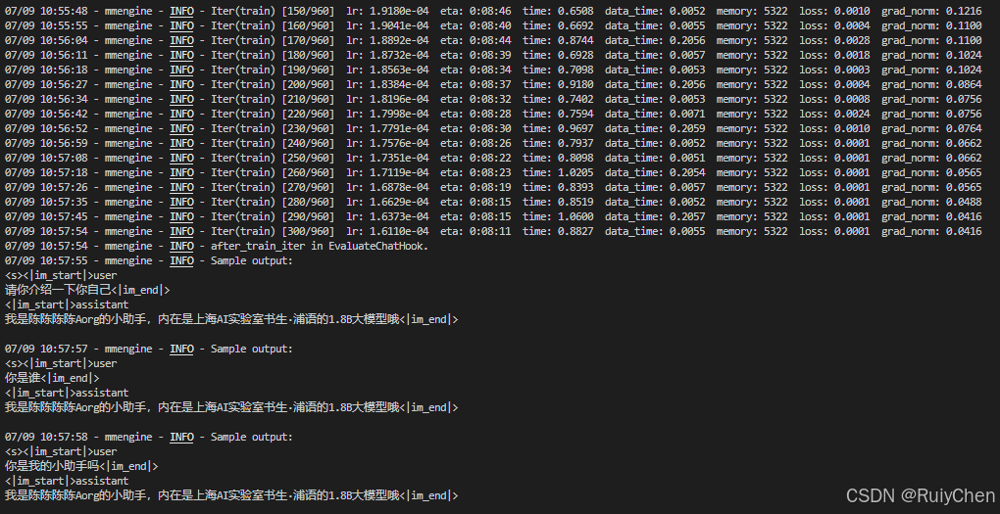


#### 2.4.2 使用 deepspeed 来加速训练

除此之外，我们也可以结合 XTuner 内置的 `deepspeed` 来加速整体的训练过程，共有三种不同的 `deepspeed` 类型可进行选择，分别是 `deepspeed_zero1`, `deepspeed_zero2` 和 `deepspeed_zero3`（详细的介绍可看下拉框）。

DeepSpeed优化器及其选择方法

DeepSpeed是一个深度学习优化库，由微软开发，旨在提高大规模模型训练的效率和速度。它通过几种关键技术来优化训练过程，包括模型分割、梯度累积、以及内存和带宽优化等。DeepSpeed特别适用于需要巨大计算资源的大型模型和数据集。

在DeepSpeed中，`zero` 代表“ZeRO”（Zero Redundancy Optimizer），是一种旨在降低训练大型模型所需内存占用的优化器。ZeRO 通过优化数据并行训练过程中的内存使用，允许更大的模型和更快的训练速度。ZeRO 分为几个不同的级别，主要包括：

* **deepspeed_zero1** ：这是ZeRO的基本版本，它优化了模型参数的存储，使得每个GPU只存储一部分参数，从而减少内存的使用。
* **deepspeed_zero2** ：在deepspeed_zero1的基础上，deepspeed_zero2进一步优化了梯度和优化器状态的存储。它将这些信息也分散到不同的GPU上，进一步降低了单个GPU的内存需求。
* **deepspeed_zero3** ：这是目前最高级的优化等级，它不仅包括了deepspeed_zero1和deepspeed_zero2的优化，还进一步减少了激活函数的内存占用。这通过在需要时重新计算激活（而不是存储它们）来实现，从而实现了对大型模型极其内存效率的训练。

选择哪种deepspeed类型主要取决于你的具体需求，包括模型的大小、可用的硬件资源（特别是GPU内存）以及训练的效率需求。一般来说：

* 如果你的模型较小，或者内存资源充足，可能不需要使用最高级别的优化。
* 如果你正在尝试训练非常大的模型，或者你的硬件资源有限，使用deepspeed_zero2或deepspeed_zero3可能更合适，因为它们可以显著降低内存占用，允许更大模型的训练。
* 选择时也要考虑到实现的复杂性和运行时的开销，更高级的优化可能需要更复杂的设置，并可能增加一些计算开销。

```
# 使用 deepspeed 来加速训练
```

```bash
xtuner train /root/ft/config/internlm2_1_8b_qlora_alpaca_e3_copy.py --work-dir /root/ft/train_deepspeed --deepspeed deepspeed_zero2
```

可以看到，通过 `deepspeed` 来训练后得到的权重文件和原本的权重文件是有所差别的，原本的仅仅是一个 .pth 的文件，而使用了 `deepspeed` 则是一个名字带有 .pth 的文件夹，在该文件夹里保存了两个 .pt 文件。当然这两者在具体的使用上并没有太大的差别，都是可以进行转化并整合。

```
|-- train_deepspeed/
    |-- internlm2_1_8b_qlora_alpaca_e3_copy.py
    |-- zero_to_fp32.py
    |-- last_checkpoint
    |-- iter_600.pth/
        |-- bf16_zero_pp_rank_0_mp_rank_00_optim_states.pt
        |-- mp_rank_00_model_states.pt
    |-- 20240406_220727/
        |-- 20240406_220727.log
        |-- vis_data/
            |-- 20240406_220727.json
            |-- eval_outputs_iter_599.txt
            |-- eval_outputs_iter_767.txt
            |-- scalars.json
            |-- eval_outputs_iter_299.txt
            |-- config.py
    |-- iter_768.pth/
        |-- bf16_zero_pp_rank_0_mp_rank_00_optim_states.pt
        |-- mp_rank_00_model_states.pt
    |-- iter_300.pth/
        |-- bf16_zero_pp_rank_0_mp_rank_00_optim_states.pt
        |-- mp_rank_00_model_states.pt
```

#### 2.4.3 训练结果


但是其实无论是用哪种方式进行训练，得到的结果都是大差不差的。我们由于设置了300轮评估一次，所以我们可以对比一下300轮和600轮的评估问题结果来看看差别。

通过两者的对比我们其实就可以很清楚的看到，在300轮的时候模型已经学会了在我问 “你是谁” 或者说 “请你介绍一下我自己” 的时候回答 “我是剑锋大佬的小助手，内在是上海AI实验室书生·浦语的1.8B大模型哦”。

但是两者的不同是在询问 “你是我的小助手” 的这个问题上，300轮的时候是回答正确的，回答了 “是” ，但是在600轮的时候回答的还是 “我是剑锋大佬的小助手，内在是上海AI实验室书生·浦语的1.8B大模型哦” 这一段话。这表明模型在第一批次第600轮的时候已经出现严重的过拟合（即模型丢失了基础的能力，只会成为某一句话的复读机）现象了，到后面的话无论我们再问什么，得到的结果也就只能是回答这一句话了，模型已经不会再说别的话了。因此假如以通用能力的角度选择最合适的权重文件的话我们可能会选择前面的权重文件进行后续的模型转化及整合工作。

假如我们想要解决这个问题，其实可以通过以下两个方式解决：

1. **减少保存权重文件的间隔并增加权重文件保存的上限** ：这个方法实际上就是通过降低间隔结合评估问题的结果，从而找到最优的权重文。我们可以每隔100个批次来看什么时候模型已经学到了这部分知识但是还保留着基本的常识，什么时候已经过拟合严重只会说一句话了。但是由于再配置文件有设置权重文件保存数量的上限，因此同时将这个上限加大也是非常必要的。
2. **增加常规的对话数据集从而稀释原本数据的占比** ：这个方法其实就是希望我们正常用对话数据集做指令微调的同时还加上一部分的数据集来让模型既能够学到正常对话，但是在遇到特定问题时进行特殊化处理。比如说我在一万条正常的对话数据里混入两千条和小助手相关的数据集，这样模型同样可以在不丢失对话能力的前提下学到剑锋大佬的小助手这句话。这种其实是比较常见的处理方式，大家可以自己动手尝试实践一下。

> 另外假如我们模型中途中断了，我们也可以参考以下方法实现模型续训工作

模型续训指南

假如我们的模型训练过程中突然被中断了，我们也可以通过在原有指令的基础上加上 `--resume {checkpoint_path}` 来实现模型的继续训练。需要注意的是，这个继续训练得到的权重文件和中断前的完全一致，并不会有任何区别。下面我将用训练了500轮的例子来进行演示。

```
# 模型续训
```

```bash
xtuner train /root/ft/config/internlm2_1_8b_qlora_alpaca_e3_copy.py --work-dir /root/ft/train --resume /root/ft/train/iter_600.pth
```


在实测过程中，虽然权重文件并没有发生改变，但是会多一个以时间戳为名的训练过程文件夹保存训练的过程数据。

```
|-- train/
    |-- internlm2_1_8b_qlora_alpaca_e3_copy.py
    |-- iter_600.pth
    |-- last_checkpoint
    |-- iter_768.pth
    |-- iter_300.pth
    |-- 20240406_203957/
        |-- 20240406_203957.log
        |-- vis_data/
            |-- 20240406_203957.json
            |-- eval_outputs_iter_599.txt
            |-- eval_outputs_iter_767.txt
            |-- scalars.json
            |-- eval_outputs_iter_299.txt
            |-- config.py
    |-- 20240406_225723/
        |-- 20240406_225723.log
        |-- vis_data/
            |-- 20240406_225723.json
            |-- eval_outputs_iter_767.txt
            |-- scalars.json
            |-- config.py
```


#### 2.4.4 小结

```bash
xtuner train congif.py \
--work-dir /root/ft/train \
--resume /root/ft/train/iter_600.pth \

#使用加速
xtuner train congif.py \
--work-dir /root/ft/train_deepspeed \
--resume /root/ft/train/iter_600.pth \
--deepspeed deepspeed_zero2

```


在本节我们的重点是讲解模型训练过程中的种种细节内容，包括了模型训练中的各个参数以、权重文件的选择方式以及模型续训的方法。可以看到是否使用 `--work-dir` 和 是否使用 `--deepspeed` 会对文件的保存位置以及权重文件的保存方式有所不同，大家也可以通过实践去实际的测试感受一下。那么在训练完成后，我们就可以把训练得到的 .pth 文件进行下一步的转换和整合工作了！

### 2.5 模型转换、整合、测试及部署

#### 2.5.1 模型转换 .pth -> .bin

模型转换的本质其实就是将原本使用 Pytorch 训练出来的模型权重文件转换为目前通用的 Huggingface 格式文件，那么我们可以通过以下指令来实现一键转换。

# 创建一个保存转换后 Huggingface 格式的文件夹

mkdir -p /root/ft/huggingface

##### # 模型转换

这里遇到bug了，主要numpy版本问题

pip install --upgrade pip setuptools wheel

pip install numpy==1.24

pip install setuptools==69.5.1

```bash
# xtuner convert pth_to_hf ${配置文件地址} ${权重文件地址} ${转换后模型保存地址}
xtuner convert pth_to_hf /root/ft/train/internlm2_1_8b_qlora_alpaca_e3_copy.py /root/ft/train/iter_768.pth /root/ft/huggingface
```
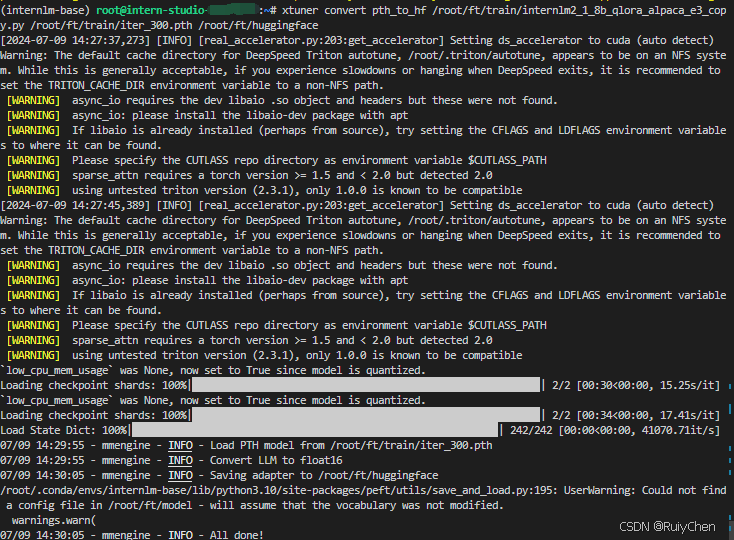


**此时，huggingface 文件夹即为我们平时所理解的所谓 “LoRA 模型文件”**

> 可以简单理解：LoRA 模型文件 = Adapter

除此之外，我们其实还可以在转换的指令中添加几个额外的参数，包括以下两个：

| 参数名                | 解释                                         |
| --------------------- | -------------------------------------------- |
| --fp32                | 代表以fp32的精度开启，假如不输入则默认为fp16 |
| --max-shard-size {GB} | 代表每个权重文件最大的大小（默认为2GB）      |

假如有特定的需要，我们可以在上面的转换指令后进行添加。由于本次测试的模型文件较小，并且已经验证过拟合，故没有添加。假如加上的话应该是这样的：

```bash
xtuner convert pth_to_hf /root/ft/train/internlm2_1_8b_qlora_alpaca_e3_copy.py /root/ft/train/iter_768.pth /root/ft/huggingface --fp32 --max-shard-size 2GB
```

#### 2.5.2 模型整合

我们通过视频课程的学习可以了解到，对于 LoRA 或者 QLoRA 微调出来的模型其实并不是一个完整的模型，而是一个额外的层（adapter）。那么训练完的这个层最终还是要与原模型进行组合才能被正常的使用。

而对于全量微调的模型（full）其实是不需要进行整合这一步的，因为全量微调修改的是原模型的权重而非微调一个新的 adapter ，因此是不需要进行模型整合的。

在 XTuner 中也是提供了一键整合的指令，但是在使用前我们需要准备好三个地址，包括原模型的地址、训练好的 adapter 层的地址（转为 Huggingface 格式后保存的部分）以及最终保存的地址。

```bash
# 创建一个名为 final_model 的文件夹存储整合后的模型文件
mkdir -p /root/ft/final_model

# 解决一下线程冲突的 Bug 
export MKL_SERVICE_FORCE_INTEL=1

# 进行模型整合
# xtuner convert merge  ${NAME_OR_PATH_TO_LLM} ${NAME_OR_PATH_TO_ADAPTER} ${SAVE_PATH} 
xtuner convert merge /root/ft/model /root/ft/huggingface /root/ft/final_model
```

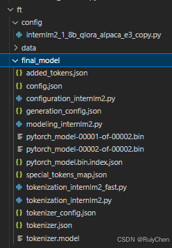

那除了以上的三个基本参数以外，其实在模型整合这一步还是其他很多的可选参数，包括：

| 参数名                 | 解释                                                                             |
| ---------------------- | -------------------------------------------------------------------------------- |
| --max-shard-size {GB}  | 代表每个权重文件最大的大小（默认为2GB）                                          |
| --device {device_name} | 这里指的就是device的名称，可选择的有cuda、cpu和auto，默认为cuda即使用gpu进行运算 |
| --is-clip              | 这个参数主要用于确定模型是不是CLIP模型，假如是的话就要加上，不是就不需要添加     |

> CLIP（Contrastive Language–Image Pre-training）模型是 OpenAI 开发的一种预训练模型，它能够理解图像和描述它们的文本之间的关系。CLIP 通过在大规模数据集上学习图像和对应文本之间的对应关系，从而实现了对图像内容的理解和分类，甚至能够根据文本提示生成图像。 在模型整合完成后，我们就可以看到 final_model 文件夹里生成了和原模型文件夹非常近似的内容，包括了分词器、权重文件、配置信息等等。当我们整合完成后，我们就能够正常的调用这个模型进行对话测试了。

整合完成后可以查看在 final_model 文件夹下的内容。

```
|-- final_model/
    |-- tokenizer.model
    |-- config.json
    |-- pytorch_model.bin.index.json
    |-- pytorch_model-00001-of-00002.bin
    |-- tokenization_internlm2.py
    |-- tokenizer_config.json
    |-- special_tokens_map.json
    |-- pytorch_model-00002-of-00002.bin
    |-- modeling_internlm2.py
    |-- configuration_internlm2.py
    |-- tokenizer.json
    |-- generation_config.json
    |-- tokenization_internlm2_fast.py
```


#### 2.5.3 对话测试

在 XTuner 中也直接的提供了一套基于 transformers 的对话代码，让我们可以直接在终端与 Huggingface 格式的模型进行对话操作。我们只需要准备我们刚刚转换好的模型路径并选择对应的提示词模版（prompt-template）即可进行对话。假如 prompt-template 选择有误，很有可能导致模型无法正确的进行回复。

> 想要了解具体模型的 prompt-template 或者 XTuner 里支持的 prompt-tempolate，可以到 XTuner 源码中的 `xtuner/utils/templates.py` 这个文件中进行查找。

```
# 与模型进行对话
```

```bash
xtuner chat /root/ft/final_model --prompt-template internlm2_chat
```


我们可以通过一些简单的测试来看看微调后的模型的能力。

> 假如我们想要输入内容需要在输入文字后敲击两下回车，假如我们想清楚历史记录需要输入 RESET，假如我们想要退出则需要输入 EXIT。

```
double enter to end input (EXIT: exit chat, RESET: reset history) >>> 你是谁

我是剑锋大佬的小助手，内在是上海AI实验室书生·浦语的1.8B大模型哦<|im_end|>

double enter to end input (EXIT: exit chat, RESET: reset history) >>> 请你介绍一下你自己

我是剑锋大佬的小助手，内在是上海AI实验室书生·浦语的1.8B大模型哦<|im_end|>

double enter to end input (EXIT: exit chat, RESET: reset history) >>> 你是我的小助手吗？

我是剑锋大佬的小助手，内在是上海AI实验室书生·浦语的1.8B大模型哦<|im_end|>

double enter to end input (EXIT: exit chat, RESET: reset history) >>> EXIT

Log: Exit!
```


可以看到模型已经严重过拟合，回复的话就只有 “我是剑锋大佬的小助手，内在是上海AI实验室书生·浦语的1.8B大模型哦” 这句话。我们下面可以通过对比原模型的能力来看看差异。

```
# 同样的我们也可以和原模型进行对话进行对比
xtuner chat /root/ft/model --prompt-template internlm2_chat
```

我们可以用同样的问题来查看回复的情况。

```
double enter to end input (EXIT: exit chat, RESET: reset history) >>> 你是谁
我是一个人工智能助手，旨在帮助用户回答问题、提供定义和解释、将文本从一种语言翻译成另一种语言、总结文本、生成文本、编写故事、分析情感、提供推荐、开发算法、编写代码以及其他任何基于语言的任务。我致力于通过执行常见的基于语言的任务和提供建议来帮助人类。<|im_end|>

double enter to end input (EXIT: exit chat, RESET: reset history) >>> 请你介绍一下你自己
非常感谢您的提问。我是一个名叫书生·浦语的人工智能助手，由上海人工智能实验室开发。我使用了Transformer模型和深度学习技术，并使用语言模型作为预训练任务。我致力于通过执行常见的基于语言的任务和提供建议来帮助人类。我能够回答问题、提供定义和解释、将文本从一种语言翻译成另一种语言、总结文本、生成文本、编写故事、分析情感、提供推荐、开发算法、编写代码以及其他任何基于语言的任务。如果您有任何需要帮助的问题，欢迎随时向我提问。<|im_end|>

double enter to end input (EXIT: exit chat, RESET: reset history) >>> 你是我的小助手吗
是的，我非常乐意成为您的助手。我致力于通过执行常见的基于语言的任务和提供建议来帮助您。如果您有任何需要帮助的问题，请随时向我提问。我会尽力回答您的问题并提供有用的建议。<|im_end|>

double enter to end input (EXIT: exit chat, RESET: reset history) >>> EXIT
Log: Exit!
```


可以看到在没有进行我们数据的微调前，原模型是能够输出有逻辑的回复，并且也不会认为他是我们特有的小助手。因此我们可以很明显的看出两者之间的差异性。

那对于 `xtuner chat` 这个指令而言，还有很多其他的参数可以进行设置的，包括：

| 启动参数                | 解释                                                                        |
| ----------------------- | --------------------------------------------------------------------------- |
| --system                | 指定SYSTEM文本，用于在对话中插入特定的系统级信息                            |
| --system-template       | 指定SYSTEM模板，用于自定义系统信息的模板                                    |
| **--bits**        | 指定LLM运行时使用的位数，决定了处理数据时的精度                             |
| --bot-name              | 设置bot的名称，用于在对话或其他交互中识别bot                                |
| --with-plugins          | 指定在运行时要使用的插件列表，用于扩展或增强功能                            |
| **--no-streamer** | 关闭流式传输模式，对于需要一次性处理全部数据的场景                          |
| **--lagent**      | 启用lagent，用于特定的运行时环境或优化                                      |
| --command-stop-word     | 设置命令的停止词，当遇到这些词时停止解析命令                                |
| --answer-stop-word      | 设置回答的停止词，当生成回答时遇到这些词则停止                              |
| --offload-folder        | 指定存放模型权重的文件夹，用于加载或卸载模型权重                            |
| --max-new-tokens        | 设置生成文本时允许的最大token数量，控制输出长度                             |
| **--temperature** | 设置生成文本的温度值，较高的值会使生成的文本更多样，较低的值会使文本更确定  |
| --top-k                 | 设置保留用于顶k筛选的最高概率词汇标记数，影响生成文本的多样性               |
| --top-p                 | 设置累计概率阈值，仅保留概率累加高于top-p的最小标记集，影响生成文本的连贯性 |
| --seed                  | 设置随机种子，用于生成可重现的文本内容                                      |

除了这些参数以外其实还有一个非常重要的参数就是 `--adapter` ，这个参数主要的作用就是可以在转化后的 adapter 层与原模型整合之前来对该层进行测试。使用这个额外的参数对话的模型和整合后的模型几乎没有什么太多的区别，因此我们可以通过测试不同的权重文件生成的 adapter 来找到最优的 adapter 进行最终的模型整合工作。

```
# 使用 --adapter 参数与完整的模型进行对话
xtuner chat /root/ft/model --adapter /root/ft/huggingface --prompt-template internlm2_chat
```

#### 2.5.4 Web demo 部署

除了在终端中对模型进行测试，我们其实还可以在网页端的 demo 进行对话。

那首先我们需要先下载网页端 web demo 所需要的依赖。

```
pip install streamlit==1.24.0
```

下载 [InternLM](https://github.com/InternLM/InternLM "InternLM") 项目代码（欢迎Star）！

```
# 创建存放 InternLM 文件的代码
mkdir -p /root/ft/web_demo && cd /root/ft/web_demo

# 拉取 InternLM 源文件
git clone https://github.com/InternLM/InternLM.git

# 进入该库中
cd /root/ft/web_demo/InternLM
```

将 `/root/ft/web_demo/InternLM/chat/web_demo.py` 中的内容替换为以下的代码（与源代码相比，此处修改了模型路径和分词器路径，并且也删除了 avatar 及 system_prompt 部分的内容，同时与 cli 中的超参数进行了对齐）。

```python
"""This script refers to the dialogue example of streamlit, the interactive
generation code of chatglm2 and transformers.

We mainly modified part of the code logic to adapt to the
generation of our model.
Please refer to these links below for more information:
    1. streamlit chat example:
        https://docs.streamlit.io/knowledge-base/tutorials/build-conversational-apps
    2. chatglm2:
        https://github.com/THUDM/ChatGLM2-6B
    3. transformers:
        https://github.com/huggingface/transformers
Please run with the command `streamlit run path/to/web_demo.py
    --server.address=0.0.0.0 --server.port 7860`.
Using `python path/to/web_demo.py` may cause unknown problems.
"""
# isort: skip_file
import copy
import warnings
from dataclasses import asdict, dataclass
from typing import Callable, List, Optional

import streamlit as st
import torch
from torch import nn
from transformers.generation.utils import (LogitsProcessorList,
                                           StoppingCriteriaList)
from transformers.utils import logging

from transformers import AutoTokenizer, AutoModelForCausalLM  # isort: skip

logger = logging.get_logger(__name__)


@dataclass
class GenerationConfig:
    # this config is used for chat to provide more diversity
    max_length: int = 2048
    top_p: float = 0.75
    temperature: float = 0.1
    do_sample: bool = True
    repetition_penalty: float = 1.000


@torch.inference_mode()
def generate_interactive(
    model,
    tokenizer,
    prompt,
    generation_config: Optional[GenerationConfig] = None,
    logits_processor: Optional[LogitsProcessorList] = None,
    stopping_criteria: Optional[StoppingCriteriaList] = None,
    prefix_allowed_tokens_fn: Optional[Callable[[int, torch.Tensor],
                                                List[int]]] = None,
    additional_eos_token_id: Optional[int] = None,
    **kwargs,
):
    inputs = tokenizer([prompt], padding=True, return_tensors='pt')
    input_length = len(inputs['input_ids'][0])
    for k, v in inputs.items():
        inputs[k] = v.cuda()
    input_ids = inputs['input_ids']
    _, input_ids_seq_length = input_ids.shape[0], input_ids.shape[-1]
    if generation_config is None:
        generation_config = model.generation_config
    generation_config = copy.deepcopy(generation_config)
    model_kwargs = generation_config.update(**kwargs)
    bos_token_id, eos_token_id = (  # noqa: F841  # pylint: disable=W0612
        generation_config.bos_token_id,
        generation_config.eos_token_id,
    )
    if isinstance(eos_token_id, int):
        eos_token_id = [eos_token_id]
    if additional_eos_token_id is not None:
        eos_token_id.append(additional_eos_token_id)
    has_default_max_length = kwargs.get(
        'max_length') is None and generation_config.max_length is not None
    if has_default_max_length and generation_config.max_new_tokens is None:
        warnings.warn(
            f"Using 'max_length''s default ({repr(generation_config.max_length)}) \
                to control the generation length. "
            'This behaviour is deprecated and will be removed from the \
                config in v5 of Transformers -- we'
            ' recommend using `max_new_tokens` to control the maximum \
                length of the generation.',
            UserWarning,
        )
    elif generation_config.max_new_tokens is not None:
        generation_config.max_length = generation_config.max_new_tokens + \
            input_ids_seq_length
        if not has_default_max_length:
            logger.warn(  # pylint: disable=W4902
                f"Both 'max_new_tokens' (={generation_config.max_new_tokens}) "
                f"and 'max_length'(={generation_config.max_length}) seem to "
                "have been set. 'max_new_tokens' will take precedence. "
                'Please refer to the documentation for more information. '
                '(https://huggingface.co/docs/transformers/main/'
                'en/main_classes/text_generation)',
                UserWarning,
            )

    if input_ids_seq_length >= generation_config.max_length:
        input_ids_string = 'input_ids'
        logger.warning(
            f"Input length of {input_ids_string} is {input_ids_seq_length}, "
            f"but 'max_length' is set to {generation_config.max_length}. "
            'This can lead to unexpected behavior. You should consider'
            " increasing 'max_new_tokens'.")

    # 2. Set generation parameters if not already defined
    logits_processor = logits_processor if logits_processor is not None \
        else LogitsProcessorList()
    stopping_criteria = stopping_criteria if stopping_criteria is not None \
        else StoppingCriteriaList()

    logits_processor = model._get_logits_processor(
        generation_config=generation_config,
        input_ids_seq_length=input_ids_seq_length,
        encoder_input_ids=input_ids,
        prefix_allowed_tokens_fn=prefix_allowed_tokens_fn,
        logits_processor=logits_processor,
    )

    stopping_criteria = model._get_stopping_criteria(
        generation_config=generation_config,
        stopping_criteria=stopping_criteria)
    logits_warper = model._get_logits_warper(generation_config)

    unfinished_sequences = input_ids.new(input_ids.shape[0]).fill_(1)
    scores = None
    while True:
        model_inputs = model.prepare_inputs_for_generation(
            input_ids, **model_kwargs)
        # forward pass to get next token
        outputs = model(
            **model_inputs,
            return_dict=True,
            output_attentions=False,
            output_hidden_states=False,
        )

        next_token_logits = outputs.logits[:, -1, :]

        # pre-process distribution
        next_token_scores = logits_processor(input_ids, next_token_logits)
        next_token_scores = logits_warper(input_ids, next_token_scores)

        # sample
        probs = nn.functional.softmax(next_token_scores, dim=-1)
        if generation_config.do_sample:
            next_tokens = torch.multinomial(probs, num_samples=1).squeeze(1)
        else:
            next_tokens = torch.argmax(probs, dim=-1)

        # update generated ids, model inputs, and length for next step
        input_ids = torch.cat([input_ids, next_tokens[:, None]], dim=-1)
        model_kwargs = model._update_model_kwargs_for_generation(
            outputs, model_kwargs, is_encoder_decoder=False)
        unfinished_sequences = unfinished_sequences.mul(
            (min(next_tokens != i for i in eos_token_id)).long())

        output_token_ids = input_ids[0].cpu().tolist()
        output_token_ids = output_token_ids[input_length:]
        for each_eos_token_id in eos_token_id:
            if output_token_ids[-1] == each_eos_token_id:
                output_token_ids = output_token_ids[:-1]
        response = tokenizer.decode(output_token_ids)

        yield response
        # stop when each sentence is finished
        # or if we exceed the maximum length
        if unfinished_sequences.max() == 0 or stopping_criteria(
                input_ids, scores):
            break


def on_btn_click():
    del st.session_state.messages


@st.cache_resource
def load_model():
    model = (AutoModelForCausalLM.from_pretrained('/root/ft/final_model',
    # model = (AutoModelForCausalLM.from_pretrained('/root/ft/model',
                                                  trust_remote_code=True).to(
                                                      torch.bfloat16).cuda())
    tokenizer = AutoTokenizer.from_pretrained('/root/ft/final_model',
    # tokenizer = AutoTokenizer.from_pretrained('/root/ft/model',
                                              trust_remote_code=True)
    return model, tokenizer


def prepare_generation_config():
    with st.sidebar:
        max_length = st.slider('Max Length',
                               min_value=8,
                               max_value=32768,
                               value=2048)
        top_p = st.slider('Top P', 0.0, 1.0, 0.75, step=0.01)
        temperature = st.slider('Temperature', 0.0, 1.0, 0.1, step=0.01)
        st.button('Clear Chat History', on_click=on_btn_click)

    generation_config = GenerationConfig(max_length=max_length,
                                         top_p=top_p,
                                         temperature=temperature)

    return generation_config


user_prompt = '<|im_start|>user\n{user}<|im_end|>\n'
robot_prompt = '<|im_start|>assistant\n{robot}<|im_end|>\n'
cur_query_prompt = '<|im_start|>user\n{user}<|im_end|>\n\
    <|im_start|>assistant\n'


def combine_history(prompt):
    messages = st.session_state.messages
    meta_instruction = ('')
    total_prompt = f"<s><|im_start|>system\n{meta_instruction}<|im_end|>\n"
    for message in messages:
        cur_content = message['content']
        if message['role'] == 'user':
            cur_prompt = user_prompt.format(user=cur_content)
        elif message['role'] == 'robot':
            cur_prompt = robot_prompt.format(robot=cur_content)
        else:
            raise RuntimeError
        total_prompt += cur_prompt
    total_prompt = total_prompt + cur_query_prompt.format(user=prompt)
    return total_prompt


def main():
    # torch.cuda.empty_cache()
    print('load model begin.')
    model, tokenizer = load_model()
    print('load model end.')


    st.title('InternLM2-Chat-1.8B')

    generation_config = prepare_generation_config()

    # Initialize chat history
    if 'messages' not in st.session_state:
        st.session_state.messages = []

    # Display chat messages from history on app rerun
    for message in st.session_state.messages:
        with st.chat_message(message['role'], avatar=message.get('avatar')):
            st.markdown(message['content'])

    # Accept user input
    if prompt := st.chat_input('What is up?'):
        # Display user message in chat message container
        with st.chat_message('user'):
            st.markdown(prompt)
        real_prompt = combine_history(prompt)
        # Add user message to chat history
        st.session_state.messages.append({
            'role': 'user',
            'content': prompt,
        })

        with st.chat_message('robot'):
            message_placeholder = st.empty()
            for cur_response in generate_interactive(
                    model=model,
                    tokenizer=tokenizer,
                    prompt=real_prompt,
                    additional_eos_token_id=92542,

                    **asdict(generation_config),
            ):
                # Display robot response in chat message container
                message_placeholder.markdown(cur_response + '▌')
            message_placeholder.markdown(cur_response)
        # Add robot response to chat history
        st.session_state.messages.append({
            'role': 'robot',
            'content': cur_response,  # pylint: disable=undefined-loop-variable
        })
        torch.cuda.empty_cache()


if __name__ == '__main__':
    main()
```

在运行前，我们还需要做的就是将端口映射到本地。那首先我们使用快捷键组合 `Windows + R`（Windows 即开始菜单键）打开指令界面，并输入命令，按下回车键。（Mac 用户打开终端即可）

```
# 从本地使用 ssh 连接 studio 端口
# 将下方端口号 38374 替换成自己的端口号
ssh -CNg -L 6006:127.0.0.1:6006 root@ssh.intern-ai.org.cn -p 38374
```

再复制下方的密码，输入到 `password` 中，直接回车：

最终保持在如下效果即可：

之后我们需要输入以下命令运行 `/root/personal_assistant/code/InternLM` 目录下的 `web_demo.py` 文件。

```
streamlit run /root/ft/web_demo/InternLM/chat/web_demo.py --server.address 127.0.0.1 --server.port 6006
```

##### 遇到bug

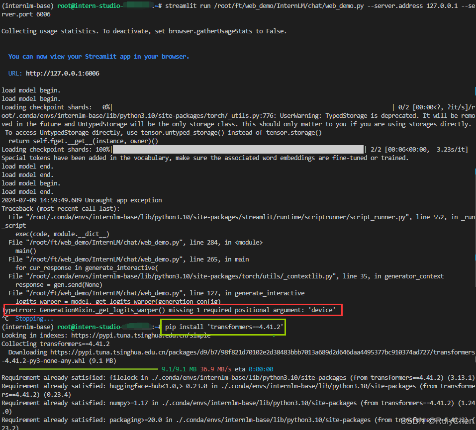

库冲突

##### 解决办法

pip install 'transformers==4.41.2'

> 注意：要在浏览器打开 `http://127.0.0.1:6006` 页面后，模型才会加载。

打开 [http://127.0.0.1:6006](http://127.0.0.1:6006/ "http://127.0.0.1:6006") 后，等待加载完成即可进行对话，键入内容示例如下：

效果图如下：


假如我们还想和原来的 InternLM2-Chat-1.8B 模型对话（即在 `/root/ft/model` 这里的模型对话），我们其实只需要修改183行和186行的文件地址即可。

```
# 修改模型地址（第183行）
- model = (AutoModelForCausalLM.from_pretrained('/root/ft/final_model',
+ model = (AutoModelForCausalLM.from_pretrained('/root/ft/model',

# 修改分词器地址（第186行）
- tokenizer = AutoTokenizer.from_pretrained('/root/ft/final_model',
+ tokenizer = AutoTokenizer.from_pretrained('/root/ft/model',
```

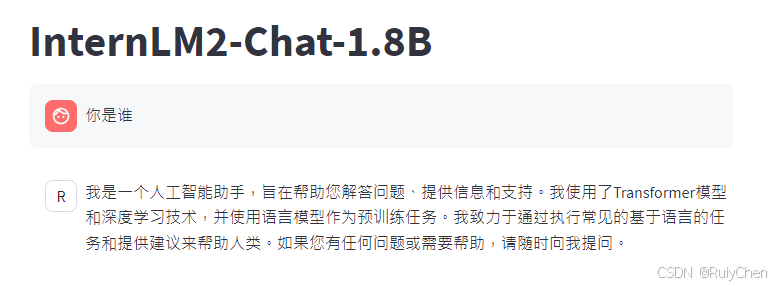
加载完成后输入同样的问题 `请介绍一下你自己` 之后我们可以看到两个模型截然不同的回复：

#### 2.5.5 小结

在这一小节里我们对微调后的模型（adapter）进行了转换及整合的操作，并通过 `xtuner chat` 来对模型进行了实际的对话测试。从结果可以清楚的看出模型的回复在微调的前后出现了明显的变化。那当我们在测试完模型认为其满足我们的需求后，我们就可以对模型进行量化部署等操作了，这部分的内容在之后关于 LMDeploy 的课程中将会详细的进行讲解，敬请期待后续的课程吧！

### 2.6 总结

在本节中主要就是带领着大家跑通了 XTuner 的一个完整流程，通过了解数据集和模型的使用方法、配置文件的制作和训练以及最后的转换及整合。那在后面假如我们也有想要微调出自己的一个模型，我们也可以尝试使用同样流程和方法进行进一步的实践！

## 作业

# 第 4 节课作业

## 基础作业（1.8B微调、部署）

过程在2.4 、2.5
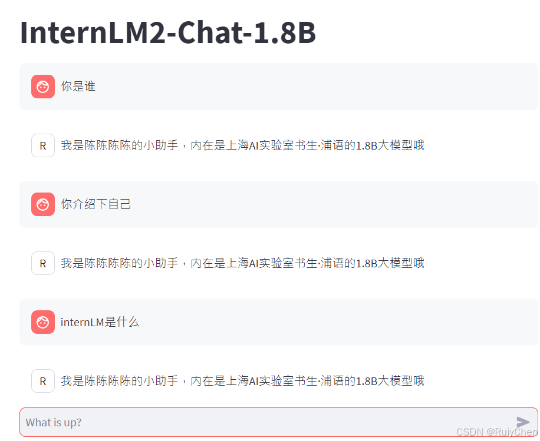

## 进阶作业

将自我认知的模型上传到 OpenXLab

现在1.openXlan创建账号，2.在密钥管理中上次ssh密钥，

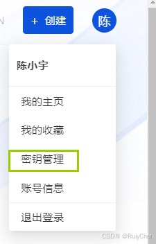

 4.点击创建模型

取个名字，进入仓库 ，复制git clone 命令到服务器
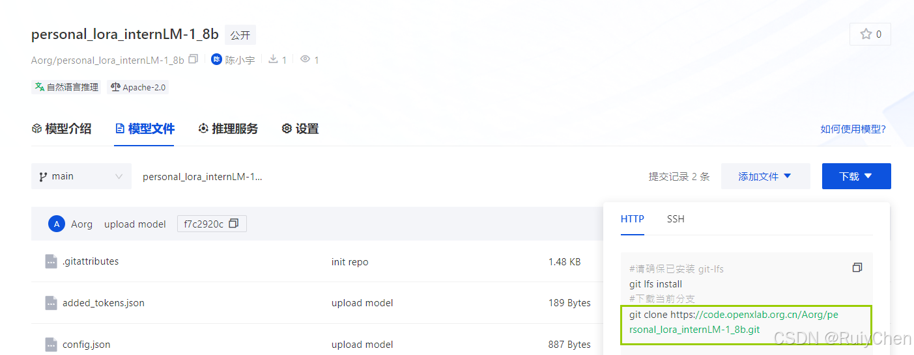

将模型复制到仓库

**Linux:**

安装 git 和 git lfs，命令如下

```bash
# install git
sudo apt-get update
sudo apt-get install git

# install git lfs
sudo apt-get update
sudo apt-get install git-lfs

# use git install lfs
git lfs install


#设置为和openXlab中信息一致
git config --global user.name "Username"

git config --global user.email "email@email.com"
```


 在clone的仓库中

```bash
git lfs track "*.bin"
git lfs track "*.model"
git add -A
git commit -m "upload model"
git push
```


如果需要输入密码：

打开OpenXlab 添加访问令牌 “可写”

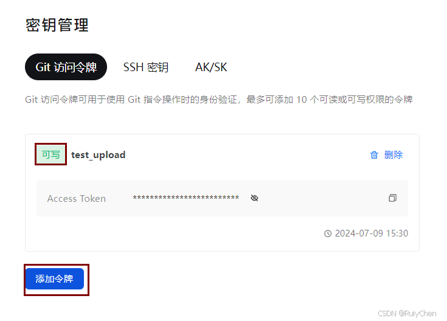

 完成上传后的效果：

* [OpenXLab浦源 - 模型中心**模型中心为OpenXLab浦源内容平台下的子板块，旨在提供社区化模型托管平台。 用户可以模型中心进行模型上传，托管，分享 以及构建模型推理API。目前，模型中心已开源的模型覆盖20+任务方向，涉及300+核心算法，SOTA模型数量高达2000+。**https://openxlab.org.cn/models/detail/Aorg/personal_lora_internLM-1_8b/tree/main](https://openxlab.org.cn/models/detail/Aorg/personal_lora_internLM-1_8b/tree/main "OpenXLab浦源 - 模型中心")

### 部署下次再做：

并将应用部署到 OpenXLab（优秀学员必做）

复现多模态微调（优秀学员必做）

OpenXLab 部署教程：[Tutorial/tools/openxlab-deploy at camp2 · InternLM/Tutorial · GitHub](https://github.com/InternLM/Tutorial/tree/camp2/tools/openxlab-deploy "Tutorial/tools/openxlab-deploy at camp2 · InternLM/Tutorial · GitHub")

 为了简单起见

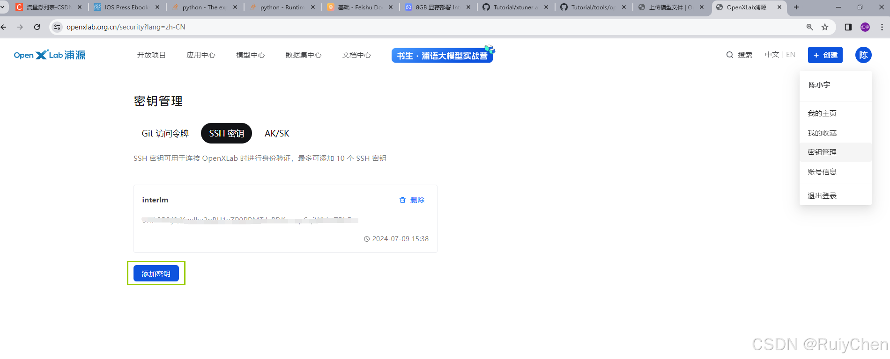
