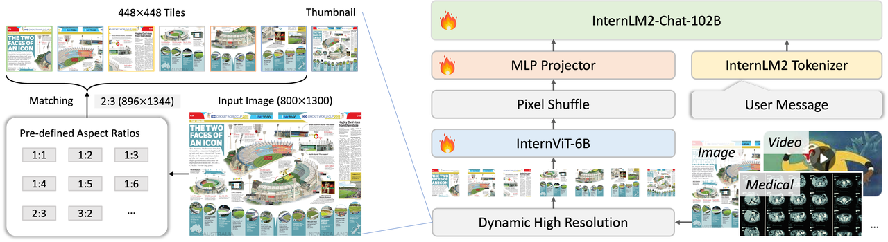

原文
https://github.com/InternLM/Tutorial/blob/camp3/docs/L2/InternVL/joke_readme.md

# InternVL 
是一种用于多模态任务的深度学习模型，旨在处理和理解多种类型的数据输入，如图像和文本。它结合了视觉和语言模型，能够执行复杂的跨模态任务，比如图文匹配、图像描述生成等。通过整合视觉特征和语言信息，InternVL 可以在多模态领域取得更好的表现

### InternVL 模型结构

对于InternVL这个模型来说，它vision模块就是一个微调过的ViT，llm模块是一个InternLM的模型。对于视觉模块来说，它的特殊之处在Dynamic High Resolution。

# InternVL 部署微调实践
我们选定的任务是让InternVL-2B生成文生图提示词，这个任务需要VLM对图片有格式化的描述并输出。
我们微调InterenVL使用xtuner。部署InternVL使用lmdeploy。

准备InternVL模型
我们使用InternVL2-2B模型。该模型已在share文件夹下挂载好，现在让我们把移动出来。

```bash
cd /root
mkdir -p model

## 复制 模型，空间不够也可以软连接

ln -s /root/share/new_models/OpenGVLab/InternVL2-2B /root/models/

# 准备环境
# 这里我们来手动配置下xtuner。

# 配置虚拟环境
# conda create --name xtuner python=3.10 -y

# 激活虚拟环境（注意：后续的所有操作都需要在这个虚拟环境中进行）
conda activate xtuner

# 安装一些必要的库
conda install pytorch==2.1.2 torchvision==0.16.2 torchaudio==2.1.2 pytorch-cuda=12.1 -c pytorch -c nvidia -y
# 安装其他依赖
apt install libaio-dev
pip install transformers==4.39.3
pip install streamlit==1.36.0

# 安装xtuner
# 创建一个目录，用来存放源代码
mkdir -p /root/InternLM/code
cd /root/InternLM/code
git clone -b v0.1.23  https://github.com/InternLM/XTuner
# 进入XTuner目录
cd /root/InternLM/code/XTuner
pip install -e '.[deepspeed]'
# 安装LMDeploy
pip install lmdeploy==0.5.3
# 安装验证
xtuner version

##命令

xtuner help
```