教程：

[https://github.com/InternLM/Tutorial/blob/camp3/docs/L2/Huixiangdou/readme.md](https://github.com/InternLM/Tutorial/blob/camp3/docs/L2/Huixiangdou/readme.md "https://github.com/InternLM/Tutorial/blob/camp3/docs/L2/Huixiangdou/readme.md") 是由书生·浦语团队开发的一款开源、专门针对国内企业级使用场景设计并优化的知识问答工具。

# 茴香豆概览，特点：

三阶段 Pipeline （前处理、拒答、响应），提高相应准确率和安全性

打通微信和飞书群聊天，适合国内知识问答场景

支持各种硬件配置安装，安装部署限制条件少

适配性强，兼容多个 LLM 和 API

傻瓜操作，安装和配置方便


### 进入 茴香豆

 [OpenXLab浦源 - 应用中心](https://openxlab.org.cn/apps/detail/tpoisonooo/huixiangdou-web "OpenXLab浦源 - 应用中心")

### 创建知识库

填写知识库名称 输入密码 就进入知识库了


### 上传资料
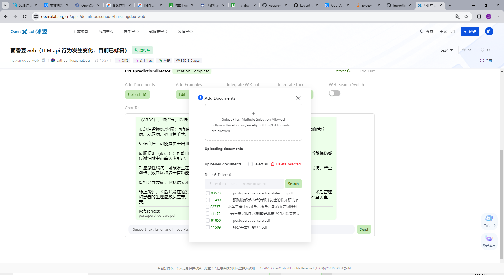
 完成上传：

### 输入需要在文档中查找的相关问题 显示参考资料
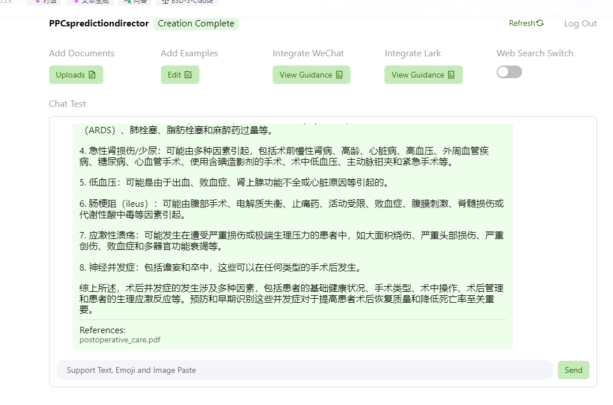


# 通过配置正反例调优知识助手效果

在真实的使用场景中，调试知识助手回答相关问题和拒答无关问题（如闲聊）是保证回答准确率和效率十分重要的部分。茴香豆的架构中，除了利用 LLM 的功能判断问题相关性，也可以通过手动添加正例（希望模型回答的问题）和反例（希望模型拒答的问题）来调优知识助手的应答效果。

在 Web 版茴香豆中，点击添加正反例下的 `查看或编辑` 按钮，进入正反例添加页面：

tips : 测试回答每次搜完记得refresh 有上下文读取

## 正例
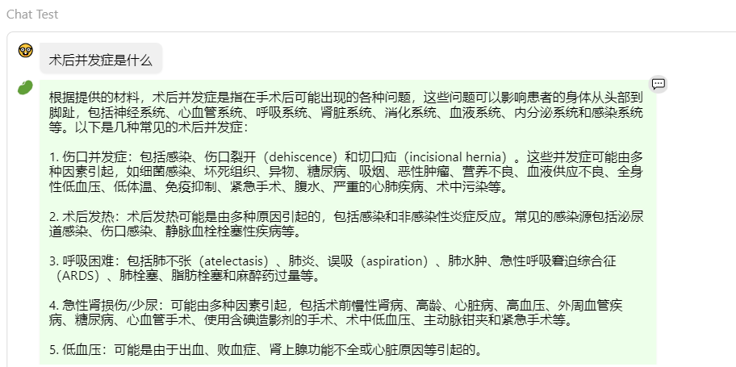
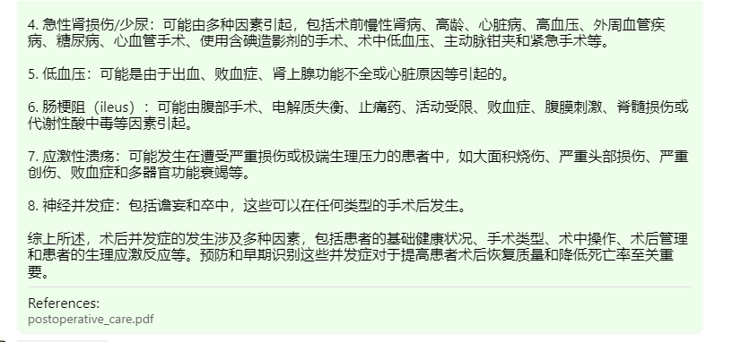

负例
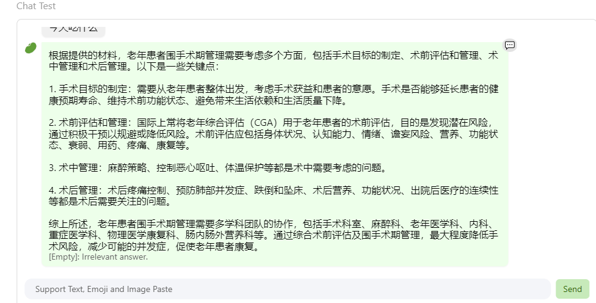

对于正例相似问题，茴香豆会在知识库中尽量搜寻相关解答，在没有相关知识的情况下，会推测答案，并在回答中提示我们该回答并不准确。这保证了回答的可追溯性。

# 本地部署茴香豆
 茴香豆本地标准版搭建
在第一部分中，我们利用 Web 版茴香豆实现了零代码开发部署一款 RAG 知识助手，在接下来的部分，我们要动手尝试将茴香豆从源码部署到本地服务器（以 InternlmStudio 为例），并开发一款简单的知识助手 Demo。

###  环境搭建
2.1.1 配置服务器
首先登录 InternStudio ，选择创建开发机：
镜像选择 Cuda11.7-conda ，资源类型选择 30% A\*100。输入开发机名称 huixiangdou, 点击立即创建。
在 开发机 页面选择刚刚创建的个人开发机 huixiangdou，单击 启动：
等服务器准备好开发机资源后，点击 进入开发机，继续进行开发环境的搭建。

2.1.2 搭建茴香豆虚拟环境
命令行中输入一下命令，创建茴香豆专用 conda 环境：
```bash 
studio-conda -o internlm-base -t huixiangdou
cd /root
# 克隆代码仓库
git clone https://github.com/internlm/huixiangdou && cd huixiangdou
git checkout 79fa810

conda activate huixiangdou
# parsing `word` format requirements
apt update
apt install python-dev libxml2-dev libxslt1-dev antiword unrtf poppler-utils pstotext tesseract-ocr flac ffmpeg lame libmad0 libsox-fmt-mp3 sox libjpeg-dev swig libpulse-dev
# python requirements
pip install BCEmbedding==0.15 cmake==3.30.2 lit==18.1.8 sentencepiece==0.2.0 protobuf==5.27.3 accelerate==0.33.0
pip install -r requirements.txt
# python3.8 安装 faiss-gpu 而不是 faiss

# 创建模型文件夹
cd /root && mkdir models

# 复制BCE模型
ln -s /root/share/new_models/maidalun1020/bce-embedding-base_v1 /root/models/bce-embedding-base_v1
ln -s /root/share/new_models/maidalun1020/bce-reranker-base_v1 /root/models/bce-reranker-base_v1

# 复制大模型参数（下面的模型，根据作业进度和任务进行**选择一个**就行）
ln -s /root/share/new_models/Shanghai_AI_Laboratory/internlm2-chat-7b /root/models/internlm2-chat-7b

sed -i '9s#.*#embedding_model_path = "/root/models/bce-embedding-base_v1"#' /root/huixiangdou/config.ini
sed -i '15s#.*#reranker_model_path = "/root/models/bce-reranker-base_v1"#' /root/huixiangdou/config.ini
sed -i '43s#.*#local_llm_path = "/root/models/internlm2-chat-7b"#' /root/huixiangdou/config.ini

```
### 知识库创建
修改完配置文件后，就可以进行知识库的搭建，本次教程选用的是茴香豆和 MMPose 的文档，利用茴香豆搭建一个茴香豆和 MMPose 的知识问答助手。
```bash 
conda activate huixiangdou

cd /root/huixiangdou && mkdir repodir

git clone https://github.com/internlm/huixiangdou --depth=1 repodir/huixiangdou
git clone https://github.com/open-mmlab/mmpose    --depth=1 repodir/mmpose

# Save the features of repodir to workdir, and update the positive and negative example thresholds into `config.ini`
mkdir workdir
python3 -m huixiangdou.service.feature_store

```
## 启动
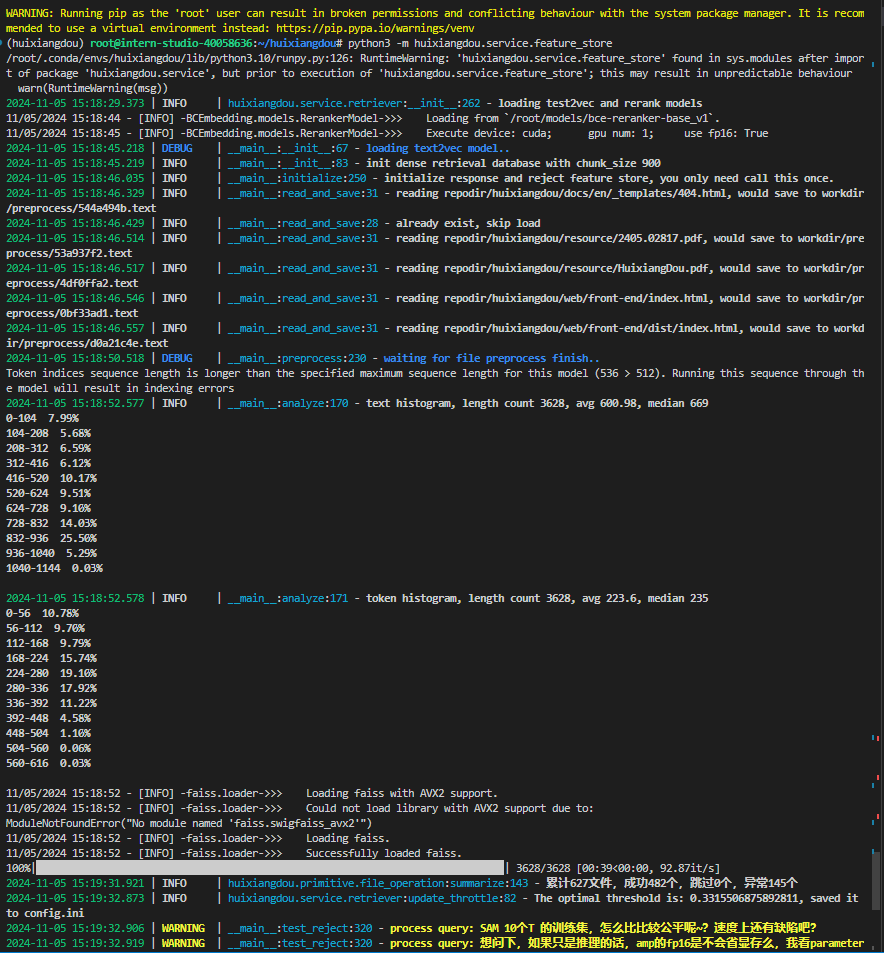
启动后各种自测
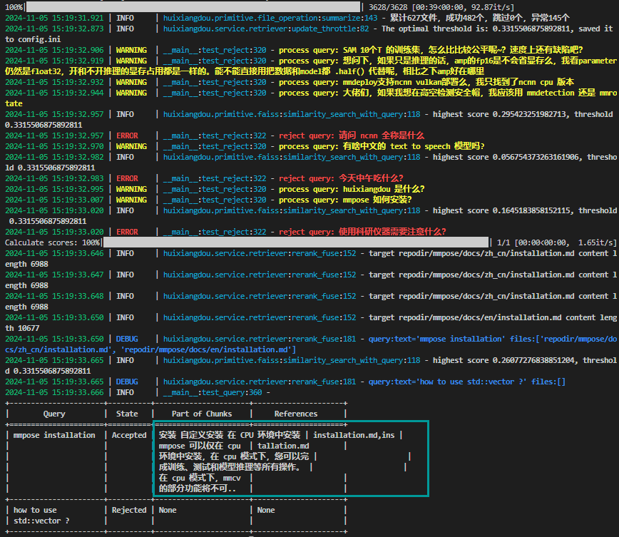

在 huixiangdou 文件加下创建 repodir 文件夹，用来储存知识库原始文档。再创建一个文件夹 workdir 用来存放原始文档特征提取到的向量知识库。

知识库创建成功后会有一系列小测试，检验问题拒答和响应效果，如图所示，关于“mmpose 安装”的问题，测试结果可以很好的反馈相应答案和对应的参考文件，但关于“std：：vector 使用”的问题，因为属于 C++ 范畴，不再在知识库范围内，测试结果显示拒答，说明我们的知识助手工作正常。

和 Web 版一样，本地版也可以通过编辑正反例来调整茴香豆的拒答和响应，正例位于 /root/huixiangdou/resource/good_questions.json 文件夹中，反例位于/root/huixiangdou/resource/bad_questions.json。

需要注意的是，每次更新原始知识文档和正反例，都需要重新运行 python3 -m huixiangdou.service.feature_store 命令进行向量知识库的重新创建和应答阈值的更新。

config.ini
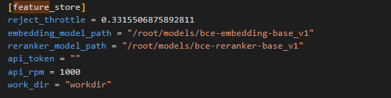

配置中可见，在运行过一次特征提取后，茴香豆的阈值从 -1.0 更新到了 0.33。 配置文件中的 work_dir 参数指定了特征提取后向量知识库存放的位置。如果有多个知识库快速切换的需求，可以通过更改该参数实现。
# 2.4 测试知识助手
### 命令行运行
运行下面的命令，可以用命令行对现有知识库问答助手进行测试：
```bash
conda activate huixiangdou
cd /root/huixiangdou
python3 -m huixiangdou.main --standalone
```

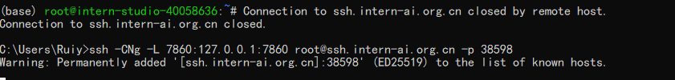
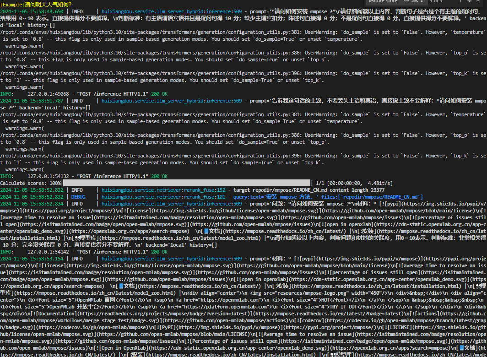
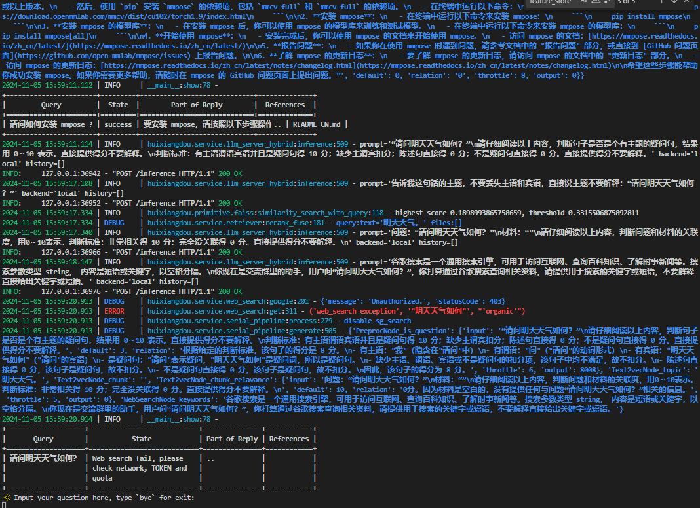

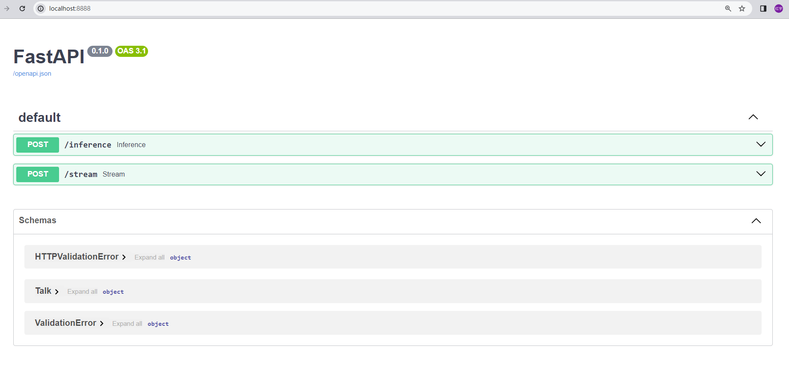

通过命令行的方式可以看到对话的结果以及中间的过程，便于我们确认知识库是否覆盖需求，正反例是否合理。

### Gradio UI 界面测试
茴香豆也用 gradio 搭建了一个 Web UI 的测试界面，用来测试本地茴香豆助手的效果。

本节课程中，茴香豆助手搭建在远程服务器上，因此需要先建立本地和服务器之间的透传，透传默认的端口为 7860，在本地机器命令行中运行如下命令：

ssh -CNg -L 7860:127.0.0.1:7860 root@ssh.intern-ai.org.cn -p <你的ssh端口号>
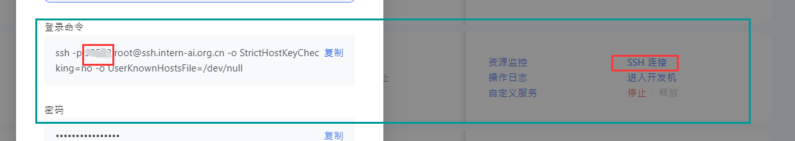
-p 就是ssh端口号

在运行茴香豆助手的服务器端，输入下面的命令，启动茴香豆 Web UI：

```bash
conda activate huixiangdou
cd /root/huixiangdou
python3 -m huixiangdou.gradio
```

看到上图相同的结果，说明 Gradio 服务启动成功，在本地浏览器中输入 127.0.0.1:7860 打开茴香豆助手测试页面、效果：
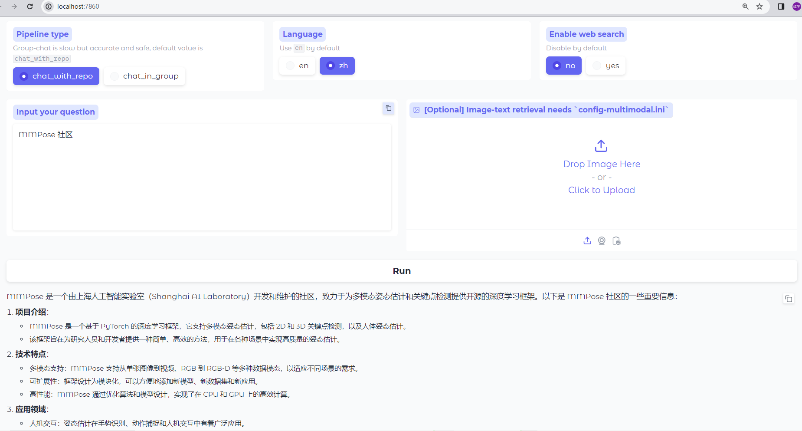


# 2.5 （选做）集成飞书&微信群聊
本地版茴香豆的群集成和 Web 版一样，需要有公网 IP 的服务器，微信仅支持特定 Android 版本。

飞书集成：

pip install -r requirements-lark-group.txt

教程 https://github.com/InternLM/HuixiangDou/blob/main/docs/add_lark_group_zh.md

申请学生白嫖服务器
设置安全组（华为进入需要设置安全组 ssh port）
下载茴香豆、python、模型
```bash
git clone https://github.com/internlm/huixiangdou && cd huixiangdou
git checkout 79fa810

#没python 下载
wget https://www.python.org/ftp/python/3.10.10/Python-3.10.10.tar.xz
#修改权限
chmod 777 Python-3.10.10.tar.xz
#安装
tar xvfJ Python-3.10.10.tar.xz

# 配置镜像
pip config set global.index-url https://pypi.tuna.tsinghua.edu.cn/simple

pip3 install lark-oapi pytoml loguru fitz PyMuPDF texttable textract jieba openai redis sse-starlette transformers scikit-learn aiohttp  duckduckgo_search
pip3 install readability-lxml
pip install lxml_html_clean
pip install lxml
# NOTE: If you get RuntimeError: Directory 'static/' does not exist after install than do:
# pip uninstall fitz
pip3 install torch torchvision torchaudio --index-url https://download.pytorch.org/whl/cpu

apt update
# 安装了python3 就不用 python-dev 
# apt install python-dev 
apt install libxml2-dev libxslt1-dev antiword unrtf poppler-utils pstotext tesseract-ocr flac ffmpeg lame libmad0 libsox-fmt-mp3 sox libjpeg-dev swig libpulse-dev
# python requirements
# 服务器没有GPU 使用cpu版本
pip install faiss-cpu
```
如果faiss 下载慢
```bash 
show pip torch
#复制地址
https://github.com/facebookresearch/faiss
```bash
pip install cmake==3.30.2 
pip install BCEmbedding==0.1.5 lit==18.1.8 sentencepiece==0.2.0 protobuf==5.27.3 accelerate==0.33.0
pip install -r requirements.txt
pip install modelscope
#执行python
python3
```
```python
#模型下载
from modelscope import snapshot_download
model_dir = snapshot_download('maidalun/bce-embedding-base_v1')
model_dir = snapshot_download('maidalun/bce-reranker-base_v1')
#节约空间下载个小模型
model_dir = snapshot_download('Shanghai_AI_Laboratory/internlm2_5-1_8b-chat')
```
修改config.ini
不保险可用备份一份config.ini
```bash
sed -i '9s#.*#embedding_model_path = "/root/.cache/modelscope/hub/maidalun/bce-embedding-base_v1"#' /root/huixiangdou/config.ini
sed -i '15s#.*#reranker_model_path = "/root/.cache/modelscope/hub/maidalun/bce-reranker-base_v1"#' /root/huixiangdou/config.ini
sed -i '43s#.*#local_llm_path = "/root/.cache/modelscope/hub/Shanghai_AI_Laboratory/internlm2_5-1_8b-chat"#' /root/huixiangdou/config.ini
```
知识库
```bash
cd /root/huixiangdou && mkdir repodir
#在repodir中放入自己的文件
# git clone https://github.com/internlm/huixiangdou --depth=1 repodir/huixiangdou
# git clone https://github.com/open-mmlab/mmpose    --depth=1 repodir/mmpose
# Save the features of repodir to workdir, and update the positive and negative example thresholds into `config.ini`
mkdir workdir
python3 -m huixiangdou.service.feature_store
```
经过不断不断不断的安装包 
终于监听服务器启动了

需要开防火墙
```bash
ufw allow 6666
```
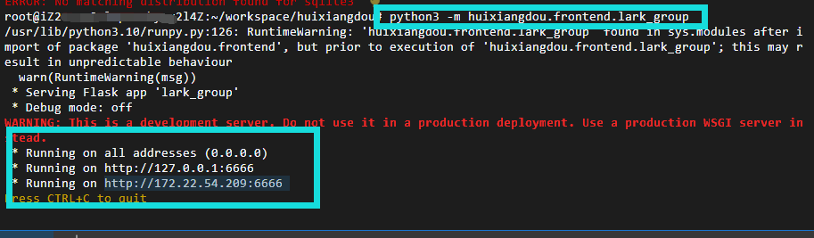

网络用公网ip

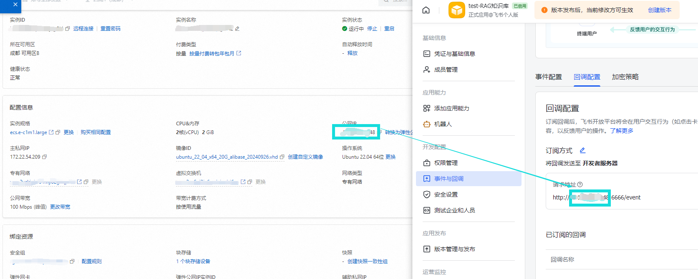

正常接收消息
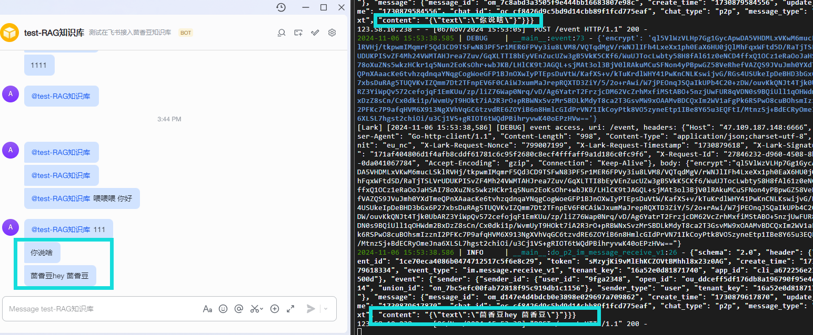
可以获取redis消息
但是 redis没存消息 =-= 好不容易到这一步愁死了
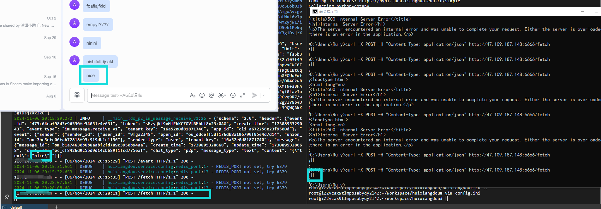
redis消息空
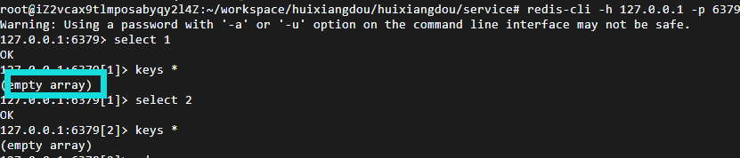


