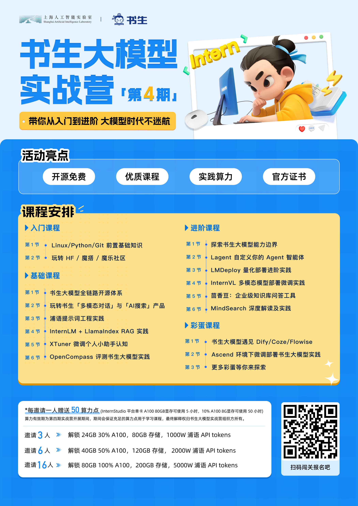

扫码参加该活动-白嫖A100

教程：

[https://github.com/InternLM/Tutorial/blob/camp3/docs/L2/Huixiangdou/readme.md](https://github.com/InternLM/Tutorial/blob/camp3/docs/L2/Huixiangdou/readme.md "https://github.com/InternLM/Tutorial/blob/camp3/docs/L2/Huixiangdou/readme.md") 是由书生·浦语团队开发的一款开源、专门针对国内企业级使用场景设计并优化的知识问答工具。

# 茴香豆概览，特点：

三阶段 Pipeline （前处理、拒答、响应），提高相应准确率和安全性

打通微信和飞书群聊天，适合国内知识问答场景

支持各种硬件配置安装，安装部署限制条件少

适配性强，兼容多个 LLM 和 API

傻瓜操作，安装和配置方便

**编辑**

# 进入 茴香豆

 [OpenXLab浦源 - 应用中心](https://openxlab.org.cn/apps/detail/tpoisonooo/huixiangdou-web "OpenXLab浦源 - 应用中心")

# 创建知识库

填写知识库名称 输入密码 就进入知识库了

**编辑**

# 上传资料

**编辑**

 完成上传：

# 输入需要在文档中查找的相关问题

 **编辑**

# 通过配置正反例调优知识助手效果

在真实的使用场景中，调试知识助手回答相关问题和拒答无关问题（如闲聊）是保证回答准确率和效率十分重要的部分。茴香豆的架构中，除了利用 LLM 的功能判断问题相关性，也可以通过手动添加正例（希望模型回答的问题）和反例（希望模型拒答的问题）来调优知识助手的应答效果。

在 Web 版茴香豆中，点击添加正反例下的 `查看或编辑` 按钮，进入正反例添加页面：

tips : 测试回答每次搜完记得refresh 有上下文读取

## 正例

**编辑**

调整前

**编辑**

 调整后

**编辑**

**编辑**

正例

**编辑**

负例

**编辑**

对于正例相似问题，茴香豆会在知识库中尽量搜寻相关解答，在没有相关知识的情况下，会推测答案，并在回答中提示我们该回答并不准确。这保证了回答的可追溯性。

# 1.4 （选做）在微信群或飞书群内使用茴香豆助手

配置发布：

**编辑**

 加入群聊：

**编辑**

 一直遇到这个问题，接口没有报错，只有日志记录这个问题：

**编辑**

遇到这个问题一直没解决

**编辑**
