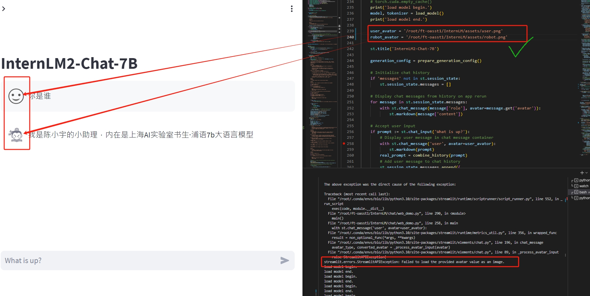

# 基础作业：

构建数据集，使用 XTuner 微调 InternLM-Chat-7B 模型, 让模型学习到它是你的智能小助手，效果如下图所示，本作业训练出来的模型的输出需要将不要葱姜蒜大佬替换成自己名字或昵称！

## 环境
按照教程搭建
https://github.com/InternLM/tutorial/blob/main/xtuner/README.md#236-%E5%B0%86%E5%BE%97%E5%88%B0%E7%9A%84-pth-%E6%A8%A1%E5%9E%8B%E8%BD%AC%E6%8D%A2%E4%B8%BA-huggingface-%E6%A8%A1%E5%9E%8B%E5%8D%B3%E7%94%9F%E6%88%90-adapter-%E6%96%87%E4%BB%B6%E5%A4%B9

## 构造数据集
按照template 生成10000条重复数据,存入一个文件 ./who

保存一个训练文件 一个测试文件，通过_train，_test区分
```python
import json
output_data=[]
system_value = "你是陈小宇的小助理，内在是上海AI实验室书生·浦语7b大语言模型"

        # Create the conversation dictionary
conversation = {
            "system": system_value,
            "text": '### Human: 你是谁?###Assistant: 我是陈小宇的小助理，内在是上海AI实验室书生·浦语7b大语言模型',
            "output": "我是陈小宇的小助理，内在是上海AI实验室书生·浦语7b大语言模型"
        }

        # Append the conversation to the output data
for i in range(10000):
    output_data.append(conversation)

    # Write the output data to a JSON file
with open('/root/ft-oasst1/openassistant-guanaco/who/who_train.jsonl', 'w', encoding='utf-8') as json_file:
        json.dump(output_data, json_file, indent=4)
with open('/root/ft-oasst1/openassistant-guanaco/who/who_eval.jsonl', 'w', encoding='utf-8') as json_file:
        json.dump(output_data, json_file, indent=4)

```
## 修改配置文件
修改internlm_chat_7b_qlora_medical_e1_copy.py
```
data_path = './who'
max_epochs = 100
```
## Train
xtuner train ./internlm_chat_7b_qlora_medical_e1_copy.py --deepspeed deepspeed_zero2
loss 收敛小到0.1基本可用了

## 合并数据
按照教程来 合并到merge文件夹下

## 测试结果


# 坑
streamlit 报错

streamlit.errors.StreamlitAPIException: Failed to load the provided avatar value as an image.

将下图中的路径改为绝对路径


# 进阶作业
将训练好的Adapter模型权重上传到 OpenXLab、Hugging Face 或者 MoelScope 任一一平台。
将训练好后的模型应用部署到 OpenXLab 平台，参考部署文档请访问：https://aicarrier.feishu.cn/docx/MQH6dygcKolG37x0ekcc4oZhnCe
