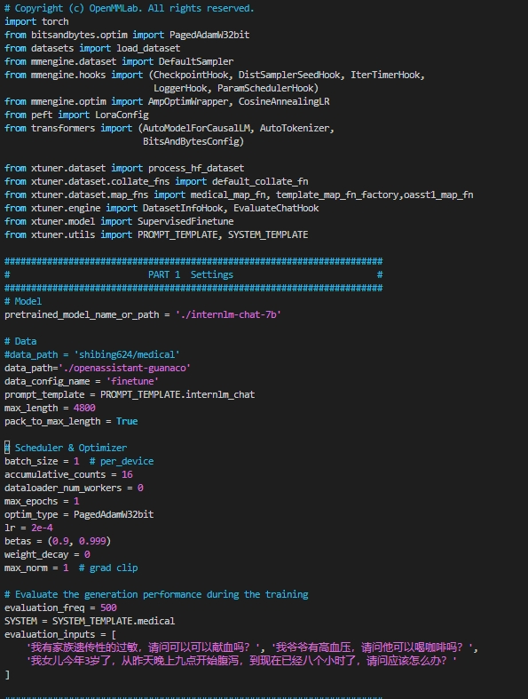

# XTuner

Xtuner 是一个大语言模型微调工具，使用教程

## 环境搭建

    基础环境
    Ubuntu + Anaconda + CUDA/CUDNN + 8GB nvidia显卡
    # 如果你是在 InternStudio 平台，则从本地 clone 一个已有 pytorch 2.0.1 的环境：

```python
#安装
/root/share/install_conda_env_internlm_base.sh xtuner0.1.9
# 如果你是在其他平台：
conda create --name xtuner0.1.9 python=3.10 -y

# 激活环境
conda activate xtuner0.1.9
# 进入家目录 （~的意思是 “当前用户的home路径”）
cd ~
# 创建版本文件夹并进入，以跟随本教程
mkdir xtuner019 && cd xtuner019


# 拉取 0.1.9 的版本源码
git clone -b v0.1.9  https://github.com/InternLM/xtuner
# 无法访问github的用户请从 gitee 拉取:
# git clone -b v0.1.9 https://gitee.com/Internlm/xtuner

# 进入源码目录
cd xtuner

# 从源码安装 XTuner
pip install -e '.[all]'
```

安装完毕后可用开始微调

# 使用XTuner

可用先输出命令，可以查看可训练的配置
## 选择可训练模型和数据
```shell
xtuner list-cfg

可训练模型和相对应数据，以下文件都已经对对应好不同模型和任务的prompt，instruction，数据格式
24.2.27结果如下：
==========================CONFIGS===========================
baichuan2_13b_base_qlora_alpaca_e3
baichuan2_13b_base_qlora_alpaca_enzh_e3
baichuan2_13b_base_qlora_alpaca_enzh_oasst1_e3
baichuan2_13b_base_qlora_alpaca_zh_e3
baichuan2_13b_base_qlora_arxiv_gentitle_e3
baichuan2_13b_base_qlora_code_alpaca_e3
baichuan2_13b_base_qlora_colorist_e5
baichuan2_13b_base_qlora_lawyer_e3
baichuan2_13b_base_qlora_oasst1_512_e3
baichuan2_13b_base_qlora_oasst1_e3
baichuan2_13b_base_qlora_open_platypus_e3
baichuan2_13b_base_qlora_sql_e3
baichuan2_13b_chat_qlora_alpaca_e3
baichuan2_13b_chat_qlora_alpaca_enzh_e3
baichuan2_13b_chat_qlora_alpaca_enzh_oasst1_e3
baichuan2_13b_chat_qlora_alpaca_zh_e3
baichuan2_13b_chat_qlora_code_alpaca_e3
baichuan2_13b_chat_qlora_lawyer_e3
baichuan2_13b_chat_qlora_oasst1_512_e3
baichuan2_13b_chat_qlora_oasst1_e3
baichuan2_13b_chat_qlora_open_platypus_e3
baichuan2_7b_base_qlora_alpaca_e3
baichuan2_7b_base_qlora_alpaca_enzh_e3
baichuan2_7b_base_qlora_alpaca_enzh_oasst1_e3
baichuan2_7b_base_qlora_alpaca_zh_e3
baichuan2_7b_base_qlora_arxiv_gentitle_e3
baichuan2_7b_base_qlora_code_alpaca_e3
baichuan2_7b_base_qlora_colorist_e5
baichuan2_7b_base_qlora_lawyer_e3
baichuan2_7b_base_qlora_oasst1_512_e3
baichuan2_7b_base_qlora_oasst1_e3
baichuan2_7b_base_qlora_open_platypus_e3
baichuan2_7b_base_qlora_sql_e3
baichuan2_7b_chat_qlora_alpaca_e3
baichuan2_7b_chat_qlora_alpaca_enzh_e3
baichuan2_7b_chat_qlora_alpaca_enzh_oasst1_e3
baichuan2_7b_chat_qlora_alpaca_zh_e3
baichuan2_7b_chat_qlora_code_alpaca_e3
baichuan2_7b_chat_qlora_lawyer_e3
baichuan2_7b_chat_qlora_oasst1_512_e3
baichuan2_7b_chat_qlora_oasst1_e3
baichuan2_7b_chat_qlora_open_platypus_e3
baichuan_13b_base_qlora_alpaca_e3
baichuan_13b_base_qlora_alpaca_enzh_e3
baichuan_13b_base_qlora_alpaca_enzh_oasst1_e3
baichuan_13b_base_qlora_alpaca_zh_e3
baichuan_13b_base_qlora_arxiv_gentitle_e3
baichuan_13b_base_qlora_code_alpaca_e3
baichuan_13b_base_qlora_colorist_e5
baichuan_13b_base_qlora_lawyer_e3
baichuan_13b_base_qlora_medical_e1
baichuan_13b_base_qlora_moss_sft_all_e1
baichuan_13b_base_qlora_moss_sft_all_e2_gpu8
baichuan_13b_base_qlora_moss_sft_plugins_e1
baichuan_13b_base_qlora_oasst1_512_e3
baichuan_13b_base_qlora_oasst1_e3
baichuan_13b_base_qlora_open_platypus_e3
baichuan_13b_base_qlora_openorca_e1
baichuan_13b_base_qlora_sql_e3
baichuan_13b_base_qlora_tiny_codes_e1
baichuan_13b_chat_qlora_alpaca_e3
baichuan_13b_chat_qlora_alpaca_enzh_e3
baichuan_13b_chat_qlora_alpaca_enzh_oasst1_e3
baichuan_13b_chat_qlora_alpaca_zh_e3
baichuan_13b_chat_qlora_arxiv_gentitle_e3
baichuan_13b_chat_qlora_code_alpaca_e3
baichuan_13b_chat_qlora_colorist_e5
baichuan_13b_chat_qlora_lawyer_e3
baichuan_13b_chat_qlora_medical_e1
baichuan_13b_chat_qlora_oasst1_512_e3
baichuan_13b_chat_qlora_oasst1_e3
baichuan_13b_chat_qlora_open_platypus_e3
baichuan_13b_chat_qlora_openorca_e1
baichuan_13b_chat_qlora_sql_e3
baichuan_13b_chat_qlora_tiny_codes_e1
baichuan_7b_qlora_alpaca_e3
baichuan_7b_qlora_alpaca_enzh_e3
baichuan_7b_qlora_alpaca_enzh_oasst1_e3
baichuan_7b_qlora_alpaca_zh_e3
baichuan_7b_qlora_arxiv_gentitle_e3
baichuan_7b_qlora_code_alpaca_e3
baichuan_7b_qlora_colorist_e5
baichuan_7b_qlora_lawyer_e3
baichuan_7b_qlora_medical_e1
baichuan_7b_qlora_moss_sft_all_e1
baichuan_7b_qlora_moss_sft_all_e2_gpu8
baichuan_7b_qlora_moss_sft_plugins_e1
baichuan_7b_qlora_oasst1_512_e3
baichuan_7b_qlora_oasst1_e3
baichuan_7b_qlora_open_platypus_e3
baichuan_7b_qlora_openorca_e1
baichuan_7b_qlora_sql_e3
baichuan_7b_qlora_tiny_codes_e1
chatglm2_6b_qlora_alpaca_e3
chatglm2_6b_qlora_alpaca_enzh_e3
chatglm2_6b_qlora_alpaca_enzh_oasst1_e3
chatglm2_6b_qlora_alpaca_zh_e3
chatglm2_6b_qlora_arxiv_gentitle_e3
chatglm2_6b_qlora_code_alpaca_e3
chatglm2_6b_qlora_colorist_e5
chatglm2_6b_qlora_lawyer_e3
chatglm2_6b_qlora_medical_e1
chatglm2_6b_qlora_oasst1_512_e3
chatglm2_6b_qlora_oasst1_e3
chatglm2_6b_qlora_open_platypus_e3
chatglm2_6b_qlora_openorca_e1
chatglm2_6b_qlora_sql_e3
chatglm2_6b_qlora_tiny_codes_e1
chatglm3_6b_base_qlora_alpaca_e3
chatglm3_6b_base_qlora_alpaca_enzh_e3
chatglm3_6b_base_qlora_alpaca_enzh_oasst1_e3
chatglm3_6b_base_qlora_alpaca_zh_e3
chatglm3_6b_base_qlora_arxiv_gentitle_e3
chatglm3_6b_base_qlora_code_alpaca_e3
chatglm3_6b_base_qlora_colorist_e5
chatglm3_6b_base_qlora_lawyer_e3
chatglm3_6b_base_qlora_medical_e1
chatglm3_6b_base_qlora_oasst1_512_e3
chatglm3_6b_base_qlora_oasst1_e3
chatglm3_6b_base_qlora_open_platypus_e3
chatglm3_6b_base_qlora_openorca_e1
chatglm3_6b_base_qlora_sql_e3
chatglm3_6b_base_qlora_tiny_codes_e1
chatglm3_6b_qlora_alpaca_e3
chatglm3_6b_qlora_alpaca_enzh_e3
chatglm3_6b_qlora_alpaca_enzh_oasst1_e3
chatglm3_6b_qlora_alpaca_zh_e3
chatglm3_6b_qlora_arxiv_gentitle_e3
chatglm3_6b_qlora_code_alpaca_e3
chatglm3_6b_qlora_colorist_e5
chatglm3_6b_qlora_lawyer_e3
chatglm3_6b_qlora_medical_e1
chatglm3_6b_qlora_oasst1_512_e3
chatglm3_6b_qlora_oasst1_e3
chatglm3_6b_qlora_open_platypus_e3
chatglm3_6b_qlora_openorca_e1
chatglm3_6b_qlora_sql_e3
chatglm3_6b_qlora_tiny_codes_e1
deepspeed_zero1
deepspeed_zero2
deepspeed_zero2_offload
deepspeed_zero3
deepspeed_zero3_offload
internlm_20b_qlora_alpaca_e3
internlm_20b_qlora_alpaca_enzh_e3
internlm_20b_qlora_alpaca_enzh_oasst1_e3
internlm_20b_qlora_alpaca_zh_e3
internlm_20b_qlora_arxiv_gentitle_e3
internlm_20b_qlora_code_alpaca_e3
internlm_20b_qlora_colorist_e5
internlm_20b_qlora_lawyer_e3
internlm_20b_qlora_msagent_react_e3_gpu8
internlm_20b_qlora_oasst1_512_e3
internlm_20b_qlora_oasst1_e3
internlm_20b_qlora_open_platypus_e3
internlm_20b_qlora_sql_e3
internlm_7b_full_alpaca_e3
internlm_7b_full_alpaca_enzh_e3
internlm_7b_full_alpaca_enzh_oasst1_e3
internlm_7b_full_alpaca_zh_e3
internlm_7b_full_oasst1_e3
internlm_7b_qlora_alpaca_e3
internlm_7b_qlora_alpaca_enzh_e3
internlm_7b_qlora_alpaca_enzh_oasst1_e3
internlm_7b_qlora_alpaca_zh_e3
internlm_7b_qlora_arxiv_gentitle_e3
internlm_7b_qlora_code_alpaca_e3
internlm_7b_qlora_colorist_e5
internlm_7b_qlora_lawyer_e3
internlm_7b_qlora_medical_e1
internlm_7b_qlora_moss_sft_all_e1
internlm_7b_qlora_moss_sft_all_e2_gpu8
internlm_7b_qlora_moss_sft_plugins_e1
internlm_7b_qlora_msagent_react_e3_gpu8
internlm_7b_qlora_oasst1_512_e3
internlm_7b_qlora_oasst1_e3
internlm_7b_qlora_oasst1_e3_hf
internlm_7b_qlora_oasst1_mmlu_e3
internlm_7b_qlora_open_platypus_e3
internlm_7b_qlora_openorca_e1
internlm_7b_qlora_sql_e3
internlm_7b_qlora_tiny_codes_e1
internlm_chat_20b_qlora_alpaca_e3
internlm_chat_20b_qlora_alpaca_enzh_e3
internlm_chat_20b_qlora_alpaca_enzh_oasst1_e3
internlm_chat_20b_qlora_alpaca_zh_e3
internlm_chat_20b_qlora_code_alpaca_e3
internlm_chat_20b_qlora_lawyer_e3
internlm_chat_20b_qlora_oasst1_512_e3
internlm_chat_20b_qlora_oasst1_e3
internlm_chat_20b_qlora_open_platypus_e3
internlm_chat_7b_qlora_alpaca_e3
internlm_chat_7b_qlora_alpaca_enzh_e3
internlm_chat_7b_qlora_alpaca_enzh_oasst1_e3
internlm_chat_7b_qlora_alpaca_zh_e3
internlm_chat_7b_qlora_arxiv_gentitle_e3
internlm_chat_7b_qlora_code_alpaca_e3
internlm_chat_7b_qlora_colorist_e5
internlm_chat_7b_qlora_lawyer_e3
internlm_chat_7b_qlora_medical_e1
internlm_chat_7b_qlora_oasst1_512_e3
internlm_chat_7b_qlora_oasst1_e3
internlm_chat_7b_qlora_open_platypus_e3
internlm_chat_7b_qlora_openorca_e1
internlm_chat_7b_qlora_sql_e3
internlm_chat_7b_qlora_tiny_codes_e1
llama2_70b_int8_lora_open_platypus_e1
llama2_70b_int8_lora_open_platypus_e1_hf
llama2_70b_qlora_open_platypus_e1
llama2_70b_qlora_open_platypus_e1_hf
llama2_7b_chat_qlora_alpaca_e3
llama2_7b_chat_qlora_alpaca_enzh_e3
llama2_7b_chat_qlora_alpaca_enzh_oasst1_e3
llama2_7b_chat_qlora_alpaca_zh_e3
llama2_7b_chat_qlora_arxiv_gentitle_e3
llama2_7b_chat_qlora_code_alpaca_e3
llama2_7b_chat_qlora_colorist_e5
llama2_7b_chat_qlora_lawyer_e3
llama2_7b_chat_qlora_medical_e1
llama2_7b_chat_qlora_oasst1_512_e3
llama2_7b_chat_qlora_oasst1_e3
llama2_7b_chat_qlora_open_platypus_e3
llama2_7b_chat_qlora_openorca_e1
llama2_7b_chat_qlora_sql_e3
llama2_7b_chat_qlora_tiny_codes_e1
llama2_7b_full_wizardlm_e1
llama2_7b_qlora_alpaca_e3
llama2_7b_qlora_alpaca_enzh_e3
llama2_7b_qlora_alpaca_enzh_oasst1_e3
llama2_7b_qlora_alpaca_zh_e3
llama2_7b_qlora_arxiv_gentitle_e3
llama2_7b_qlora_code_alpaca_e3
llama2_7b_qlora_colorist_e5
llama2_7b_qlora_lawyer_e3
llama2_7b_qlora_medical_e1
llama2_7b_qlora_moss_sft_all_e1
llama2_7b_qlora_moss_sft_all_e2_gpu8
llama2_7b_qlora_moss_sft_plugins_e1
llama2_7b_qlora_msagent_react_e3_gpu8
llama2_7b_qlora_oasst1_512_e3
llama2_7b_qlora_oasst1_e3
llama2_7b_qlora_open_platypus_e3
llama2_7b_qlora_openorca_e1
llama2_7b_qlora_sql_e3
llama2_7b_qlora_tiny_codes_e1
llama_7b_qlora_alpaca_e3
llama_7b_qlora_alpaca_enzh_e3
llama_7b_qlora_alpaca_enzh_oasst1_e3
llama_7b_qlora_alpaca_zh_e3
llama_7b_qlora_arxiv_gentitle_e3
llama_7b_qlora_code_alpaca_e3
llama_7b_qlora_colorist_e5
llama_7b_qlora_lawyer_e3
llama_7b_qlora_medical_e1
llama_7b_qlora_moss_sft_all_e1
llama_7b_qlora_moss_sft_all_e2_gpu8
llama_7b_qlora_moss_sft_plugins_e1
llama_7b_qlora_oasst1_512_e3
llama_7b_qlora_oasst1_e3
llama_7b_qlora_open_platypus_e3
llama_7b_qlora_openorca_e1
llama_7b_qlora_sql_e3
llama_7b_qlora_tiny_codes_e1
mistral_7b_qlora_skypile_pretrain_e1
qwen_7b_chat_qlora_alpaca_e3
qwen_7b_chat_qlora_alpaca_enzh_e3
qwen_7b_chat_qlora_alpaca_enzh_oasst1_e3
qwen_7b_chat_qlora_alpaca_zh_e3
qwen_7b_chat_qlora_arxiv_gentitle_e3
qwen_7b_chat_qlora_code_alpaca_e3
qwen_7b_chat_qlora_colorist_e5
qwen_7b_chat_qlora_lawyer_e3
qwen_7b_chat_qlora_medical_e1
qwen_7b_chat_qlora_oasst1_512_e3
qwen_7b_chat_qlora_oasst1_e3
qwen_7b_chat_qlora_open_platypus_e3
qwen_7b_chat_qlora_openorca_e1
qwen_7b_chat_qlora_sql_e3
qwen_7b_chat_qlora_tiny_codes_e1
qwen_7b_qlora_alpaca_e3
qwen_7b_qlora_alpaca_enzh_e3
qwen_7b_qlora_alpaca_enzh_oasst1_e3
qwen_7b_qlora_alpaca_zh_e3
qwen_7b_qlora_arxiv_gentitle_e3
qwen_7b_qlora_code_alpaca_e3
qwen_7b_qlora_colorist_e5
qwen_7b_qlora_lawyer_e3
qwen_7b_qlora_medical_e1
qwen_7b_qlora_moss_sft_all_e1
qwen_7b_qlora_moss_sft_all_e2_gpu8
qwen_7b_qlora_moss_sft_plugins_e1
qwen_7b_qlora_oasst1_512_e3
qwen_7b_qlora_oasst1_e3
qwen_7b_qlora_open_platypus_e3
qwen_7b_qlora_openorca_e1
qwen_7b_qlora_sql_e3
qwen_7b_qlora_tiny_codes_e1
starcoder_qlora_stack_exchange_example
yi_34b_qlora_alpaca_enzh_e3
yi_6b_qlora_alpaca_enzh_e3
zephyr_7b_beta_qlora_alpaca_e3
=============================================================
```
比如：internlm_chat_7b_qlora_oasst1_e3 
名称含义|名称
----|----
模型名|internlm_chat_7b
使用算法| qlora
数据集	| oasst1

#### 配置文件拷贝方法：
拷贝一个配置文件到当前目录： # xtuner copy-cfg 配置文件名称 保存位置

#### 修改配置文件：
```shell
vim internlm_chat_7b_qlora_oasst1_e3_copy.py
```


需要修改的在PART1 Settings

修改需要加载模型

pretrained_model_name_or_path = './internlm-chat-7b'

修改需要加载数据

data_path = './openassistant-guanaco'

其他参数按照喜好修改
# Xtuner微调
```shell
xtuner train 配置文件地址 
```
如果需要deepspeed加速
```shell
xtuner train 配置文件地址--deepspeed deepspeed_zero2
```
### 开始训练
如下图正常

map 说明数据格式和template契合

load checkpoint 说明模型地址正确，模型正常加载


正常训练

xtuner 会持续输出训练信息


当前文件夹会产生一个 work_dirs
epoch_1.pth 就是训练得到的adapter文件


# 合并原模型和Adapter
xtuner convert pth_to_hf 配置文件地址 adapter文件地址 保存地址

example
```shell
mkdir hf
export MKL_SERVICE_FORCE_INTEL=1
export MKL_THREADING_LAYER=GNU
xtuner convert pth_to_hf ./internlm_chat_7b_qlora_oasst1_e3_copy.py ./work_dirs/internlm_chat_7b_qlora_oasst1_e3_copy/epoch_1.pth ./hf
```

### 合并后模型对话
```shell
# 加载 Adapter 模型对话（Float 16）
xtuner chat ./hf --prompt-template internlm_chat

# 4 bit 量化加载
# xtuner chat ./hf --bits 4 --prompt-template internlm_chat
```
跑个demo
修改cli_demo.py
model_name_or_path = "保存的模型位置"
```
- model_name_or_path = "/root/model/Shanghai_AI_Laboratory/internlm-chat-7b"
+ model_name_or_path = "hf"
```
运行
```shell
python ./cli_demo.py
```

# 自定义数据集训练

主要是对齐 template ，以便统一map 建议看源码 

## 自定义训练
修改配置文件
以下都是需要注意的参数
```
# 修改import部分
- from xtuner.dataset.map_fns import oasst1_map_fn, template_map_fn_factory
+ from xtuner.dataset.map_fns import template_map_fn_factory

# 修改模型为本地路径
- pretrained_model_name_or_path = 'internlm/internlm-chat-7b'
+ pretrained_model_name_or_path = './internlm-chat-7b'

# 修改训练数据为 MedQA2019-structured-train.jsonl 路径
- data_path = 'timdettmers/openassistant-guanaco'
+ data_path = 'MedQA2019-structured-train.jsonl'

# 修改 train_dataset 对象
train_dataset = dict(
    type=process_hf_dataset,
-   dataset=dict(type=load_dataset, path=data_path),
+   dataset=dict(type=load_dataset, path='json', data_files=dict(train=data_path)),
    tokenizer=tokenizer,
    max_length=max_length,
-   dataset_map_fn=alpaca_map_fn,
+   dataset_map_fn=None,
    template_map_fn=dict(
        type=template_map_fn_factory, template=prompt_template),
    remove_unused_columns=True,
    shuffle_before_pack=True,
    pack_to_max_length=pack_to_max_length)
```
开始训练
```
xtuner train internlm_chat_7b_qlora_medqa2019_e3.py --deepspeed deepspeed_zero2
```
# 【补充】用 MS-Agent 数据集 赋予 LLM 以 Agent 能力
MSAgent 数据集每条样本包含一个对话列表（conversations），其里面包含了 system、user、assistant 三种字段。其中：

system: 表示给模型前置的人设输入，其中有告诉模型如何调用插件以及生成请求

user: 表示用户的输入 prompt，分为两种，通用生成的prompt和调用插件需求的 prompt

assistant: 为模型的回复。其中会包括插件调用代码和执行代码，调用代码是要 LLM 生成的，而执行代码是调用服务来生成结果的

一条调用网页搜索插件查询“上海明天天气”的数据样本示例如下图所示：


微调步骤如上

重点是合适的数据去训练

### 添加 serper 环境变量
开始 chat 之前，还要加个 serper 的环境变量：

去 serper.dev 免费注册一个账号，生成自己的 api key。这个东西是用来给 lagent 去获取 google 搜索的结果的。等于是 serper.dev 帮你去访问 google，而不是从你自己本地去访问 google 了。


添加 serper api key 到环境变量：
```shell
export SERPER_API_KEY=abcdefg
```

### agent 启动
```shell
xtuner chat ./internlm-chat-7b --adapter internlm-7b-qlora-msagent-react --lagent
```
已知问题的解决方法：
https://docs.qq.com/doc/DY1d2ZVFlbXlrUERj
tuner chat 增加 --lagent 参数后，报错 TypeError: transfomers.modelsauto.auto factory. BaseAutoModelClass.from pretrained() got multiple values for keyword argument "trust remote code"
```shell
vim /root/xtuner019/xtuner/xtuner/tools/chat.py
```
注释代码：


来自https://github.com/InternLM/tutorial/blob/main/xtuner/README.md


