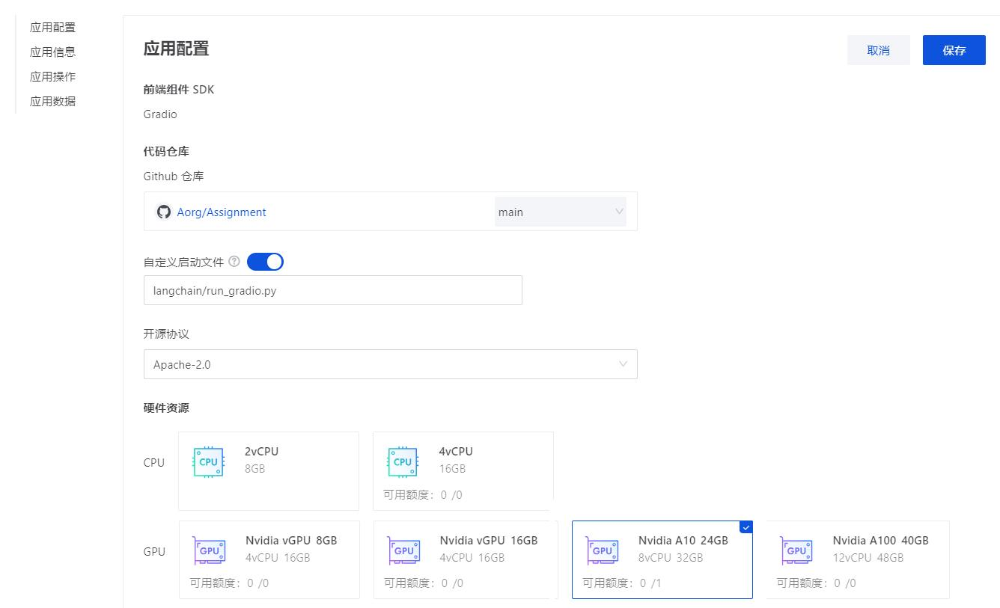
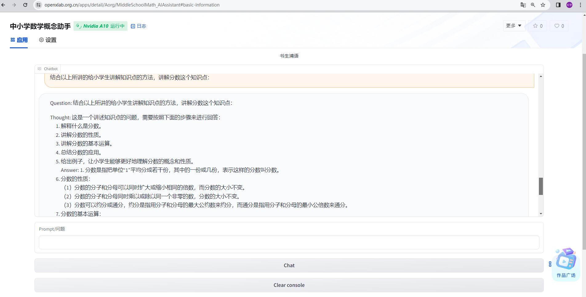
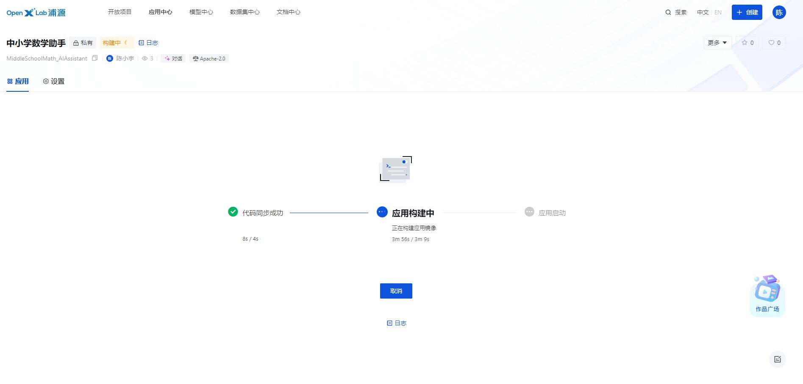
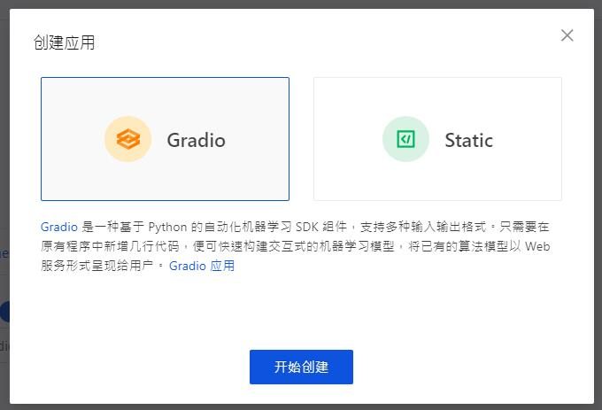
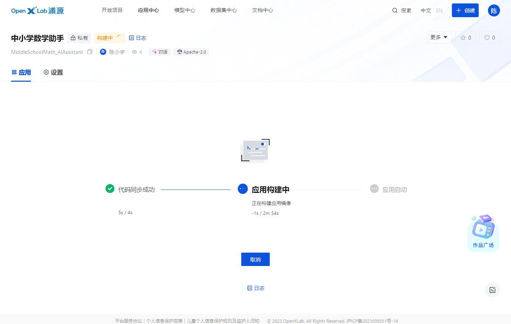
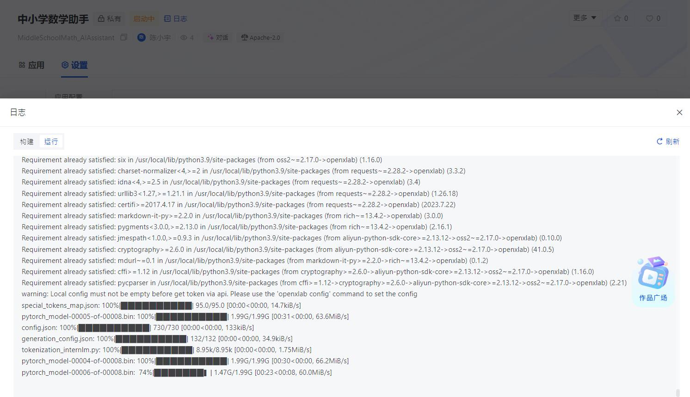
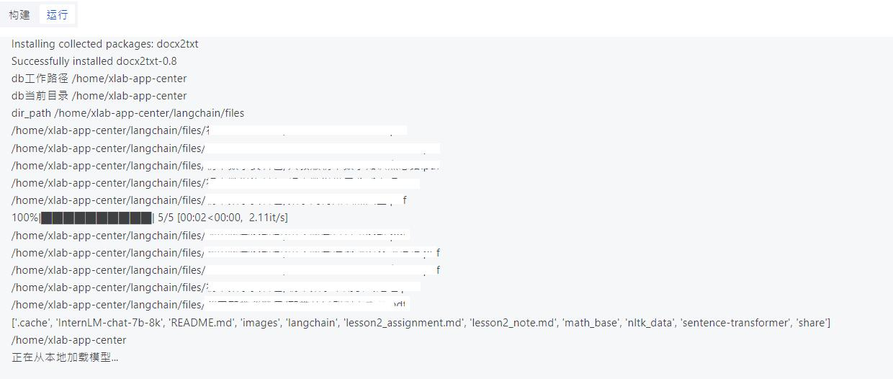
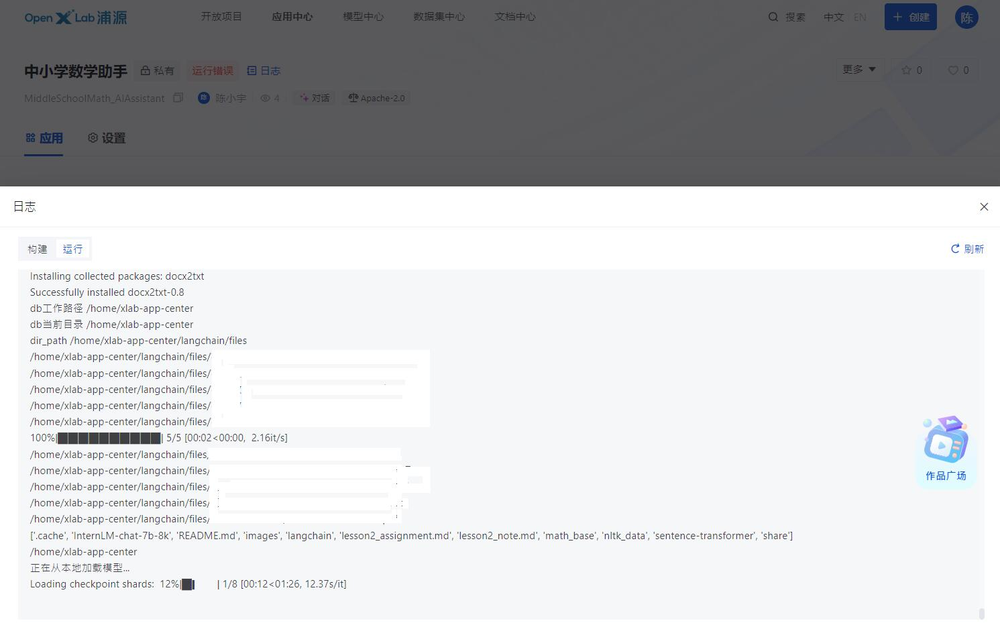
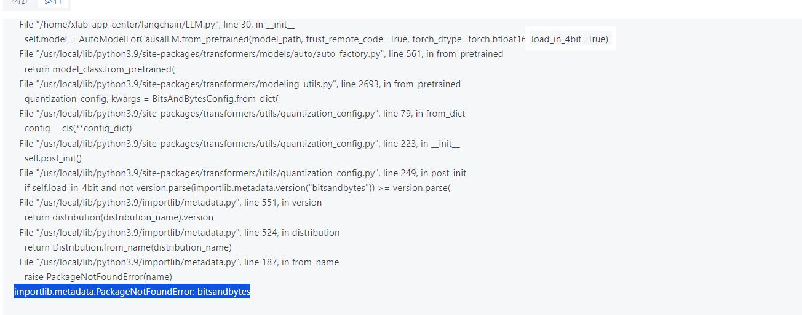

# **基础作业**：

## 复现课程知识库助手搭建过程 (截图)
### 1.环境代码准备
    配置环境 下载模型 下载代码
<<<<<<< HEAD

=======
>>>>>>> eed5406b7fb7092e980ad9d286b1a410600d83b5

### 2.化为向量知识库 持久化储存
运行 create_db.py


### 3.基于InternLM模型自定义 LLM 类
    model_path = "下载的internlm-chat-7b模型地址"
### 4.使用知识库助手
    persist_directory=持久化知识库位置
     HuggingFaceEmbeddings(model_name=下载的向量模型位置)
     llm = InternLM_LLM(model_path = 下载的internlm-chat-7b模型地址)
    运行 run_gradio.py


# **进阶作业**：
## 选择一个垂直领域，收集该领域的专业资料构建专业知识库，并搭建专业问答助手，并在 [OpenXLab](https://openxlab.org.cn/apps) 上成功部署（截图，并提供应用地址）
    想要部署一个关于中小学数学概念的知识库，
    需要读取pdf，docx文件转化为向量知识库持久化部署。每次输入

### 部署成功
   平台部署地址：https://openxlab.org.cn/apps/detail/Aorg/MiddleSchoolMath_AIAssistant
   
   申请资源很快就批下来了，选择申请的资源

改了几个bug，终于部署成功了

---------------------------------------- 部署成功以前的记录---------------------------------------------
### 第一次部署
    OpenXLab部署，多次尝试不成功，
    1.读取pdf文件的库一直有问题。
    2.第三方和Openxlab中的模型部署，调试，主要是调取规则花了点时间，问题已经解决。
    3.资源不足，模型加载不了。 
    但是在虚拟服务器上和本地是能跑通的。还在尝试中


## 1环境配置
除了教程的环境，如果需要读取pdf,docx文件需要安装以下包
```shell
pip install pypdf
pip install pdfminer.six
pip install opencv-python
pip install pytesseract
pip install python-docx
```
## 2向量模型下载
创建 download_hf.py 下载向量模型
```python
import os
# 设置环境变量
os.environ['HF_ENDPOINT'] = 'https://hf-mirror.com'
os.system('huggingface-cli download --resume-download sentence-transformers/paraphrase-multilingual-MiniLM-L12-v2 --local-dir /home/chy/api/tutorial/langchain/demo/model/sentence-transformer')
```
在bash中运行
```shell
nohup python download_hf.py > log_download_hf.log 2>&1 &
```
## 3.上传知识库
上传垂直领域知识库，create_db.py中修改变量
```python
#检索模型路径
model_name="model/sentence-transformer"
# 定义持久化路径
persist_directory = 'data_base/vector_db/chroma'
# 目标文件位置
tar_dir = [
    "文档位置1"，
    "文档位置2"
    ...
]
```
运行 create_db.py

目标位置检索文档->文档->向量知识库->持久化
## 3 InternLM 接入 LangChain
以下使用教程中的描述：

为便捷构建 LLM 应用，我们需要基于本地部署的 InternLM，继承 LangChain 的 LLM 类自定义一个 InternLM LLM 子类，从而实现将 InternLM 接入到 LangChain 框架中。完成 LangChain 的自定义 LLM 子类之后，可以以完全一致的方式调用 LangChain 的接口，而无需考虑底层模型调用的不一致。

基于本地部署的 InternLM 自定义 LLM 类并不复杂，我们只需从 LangChain.llms.base.LLM 类继承一个子类，并重写构造函数与 `_call` 函数即可：

```python
from langchain.llms.base import LLM
from typing import Any, List, Optional
from langchain.callbacks.manager import CallbackManagerForLLMRun
from transformers import AutoTokenizer, AutoModelForCausalLM
import torch

class InternLM_LLM(LLM):
    # 基于本地 InternLM 自定义 LLM 类
    tokenizer : AutoTokenizer = None
    model: AutoModelForCausalLM = None

    def __init__(self, model_path :str):
        # model_path: InternLM 模型路径
        # 从本地初始化模型
        super().__init__()
        print("正在从本地加载模型...")
        self.tokenizer = AutoTokenizer.from_pretrained(model_path, trust_remote_code=True)
        self.model = AutoModelForCausalLM.from_pretrained(model_path, trust_remote_code=True).to(torch.bfloat16).cuda()
        self.model = self.model.eval()
        print("完成本地模型的加载")

    def _call(self, prompt : str, stop: Optional[List[str]] = None,
                run_manager: Optional[CallbackManagerForLLMRun] = None,
                **kwargs: Any):
        # 重写调用函数
        system_prompt = """You are an AI assistant whose name is InternLM (书生·浦语).
        - InternLM (书生·浦语) is a conversational language model that is developed by Shanghai AI Laboratory (上海人工智能实验室). It is designed to be helpful, honest, and harmless.
        - InternLM (书生·浦语) can understand and communicate fluently in the language chosen by the user such as English and 中文.
        """
        
        messages = [(system_prompt, '')]
        response, history = self.model.chat(self.tokenizer, prompt , history=messages)
        return response
        
    @property
    def _llm_type(self) -> str:
        return "InternLM"
```

## 运行run_gradio.py
本地运行成功


# 尝试在OpenXlab部署应用
将代码上传到github仓库中
代码地址：https://github.com/Aorg/Assignment/tree/main/langchain

打开openXlab ，登陆，右上角点击‘+创建’

###  创建Gradio
如图：


### 输入仓库地址

### 设置运行代码为 langchain\gradio.py


### 同步代码

由于平台是直接运行 .py文件，需要安装的库都使用os.system，如下
```python
import os
os.system("pip install langchain==0.0.292")
os.system("git clone https://gitee.com/yzy0612/nltk_data.git  --branch gh-pages;cd nltk_data;mv packages/*  ./;cd tokenizers;unzip punkt.zip;cd ../taggers;unzip averaged_perceptron_tagger.zip")
```

从openXlab下载模型，默认地址'/home/xlab-app-center'
```python
os.system("pip install -U openxlab")
    from openxlab.model import download
    download(model_repo='OpenLMLab/InternLM-chat-7b',output='/home/xlab-app-center/InternLM-chat-7b')
```

下载完成后

### 成功建立持久化向量知识库


### 模型加载失败
    之前由于代码默认使用cuda，但平台未配置gpu资源，加载模型的时，运行失败

    后来改成cpu加载，发现还是不行， 因为遗漏平台只分配了8G内存。能加载，只能加载一点点...

    正在申请资源，量化为4bit尝试运行。
    
   需要cuda包支持，跑不了，还是申请资源吧。

#### 坑1, 
    model have no fuction chat()
可能是自己不小心改错了。    
在LLM.py加载模型中，eval少了括号加上就行
```python
    self.model = self.model.eval()
```
#### 坑2, 
   InternLM-chat-7B模型总是输出一些乱码，也有token长度限制。在使用模型中，从感觉上来说能接收更长token的模型，生成的结果更好，所以这次使用了InternLM-chat-7B-8k，暂时还没有遇到报错
   


