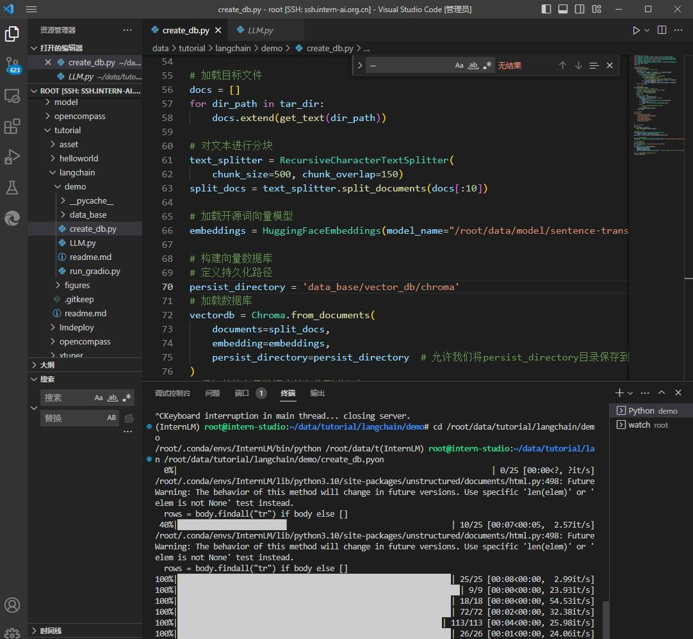

# 基于InternLM-7B 和Langchain 搭建知识库
使用InternStudio算力平台，创建开发机，选择自带镜像cuda11.7-conda

    虚拟机有jupyter,终端，Vscode，使用非常方便。
    虚拟机本地已准备了internlm-chat-7b模型，在目录文件下/root/share/temp/model_repos/
    创建pytorch2.0.1环境非常简单，运行/root/share/install_conda_env_internlm_base.sh
### 环境搭建

```shell
#创建环境
/root/share/install_conda_env_internlm_base.sh InternLM
conda activate InternLM
#升级pip,安装包
python -m pip install --upgrade pip

#模型用modelscope下载需要
pip install modelscope==1.9.5
#模型运行依赖包
pip install transformers==4.35.2
pip install streamlit==1.24.0
pip install sentencepiece==0.1.99
pip install accelerate==0.24.1
#langchain依赖包
pip install langchain==0.0.292
pip install gradio==4.4.0
pip install chromadb==0.4.15
pip install sentence-transformers==2.2.2
pip install unstructured==0.10.30
pip install markdown==3.3.7
#需要使用到开源词向量模型 Sentence Transformer，先安装huggingface-cli 命令行工具
pip install -U huggingface_hub

#复制模型
mkdir -p /root/data/model/Shanghai_AI_Laboratory
cp -r /root/share/temp/model_repos/internlm-chat-7b /root/data/model/Shanghai_AI_Laboratory/internlm-chat-7b

# 下载 NLTK 相关资源
# 我们在使用开源词向量模型构建开源词向量的时候，需要用到第三方库 `nltk` 的一些资源。正常情况下，其会自动从互联网上下载，但可能由于网络原因会导致下载中断，此处我们可以从国内仓库镜像地址下载相关资源，保存到服务器上。
# 我们用以下命令下载 nltk 资源并解压到服务器上：


cd /root
git clone https://gitee.com/yzy0612/nltk_data.git  --branch gh-pages
cd nltk_data
mv packages/*  ./
cd tokenizers
unzip punkt.zip
cd ../taggers
unzip averaged_perceptron_tagger.zip

# 下载项目代码
cd /root/data
git clone https://github.com/InternLM/tutorial
```

### 下载模型
创建download.py
```python
#modelscope下载大语言模型Internlm-chat-7b
import torch
from modelscope import snapshot_download, AutoModel, AutoTokenizer
import os
model_dir = snapshot_download('Shanghai_AI_Laboratory/internlm-chat-7b', cache_dir='/root/data/model', revision='v1.0.3')

#huggingface 下载向量模型sentence-transformer
# 设置环境变量
os.environ['HF_ENDPOINT'] = 'https://hf-mirror.com'

# 下载模型
os.system('huggingface-cli download --resume-download sentence-transformers/paraphrase-multilingual-MiniLM-L12-v2 --local-dir /root/data/model/sentence-transformer')
```
进入当前文件夹，执行以下命令，使用nohup服务器断连接仍然保持下载
```shell
nohup python download.py > log_download.log 2>&1 &
tail -f log_download.log 
```
下载完成后环境搭建完成

## 知识库搭建
### 1 加载数据
流程：

    1.读取特定文件-2.使用向量模型->3.加载为向量文件-4.使用向量数据->5持久化存放

创建一个文件夹，放入知识库文件
我们首先将上述仓库中所有满足条件的文件路径找出来，我们定义一个函数，该函数将递归指定文件夹路径，返回其中所有满足条件（即后缀名为 .md 或者 .txt 的文件）的文件路径：

```python
import os 
def get_files(dir_path):
    # args：dir_path，目标文件夹路径
    file_list = []
    for filepath, dirnames, filenames in os.walk(dir_path):
        # os.walk 函数将递归遍历指定文件夹
        for filename in filenames:
            # 通过后缀名判断文件类型是否满足要求
            if filename.endswith(".md"):
                # 如果满足要求，将其绝对路径加入到结果列表
                file_list.append(os.path.join(filepath, filename))
            elif filename.endswith(".txt"):
                file_list.append(os.path.join(filepath, filename))
    return file_list
```


得到所有目标文件路径之后，我们可以使用 LangChain 提供的 FileLoader 对象来加载目标文件，得到由目标文件解析出的纯文本内容。由于不同类型的文件需要对应不同的 FileLoader，我们判断目标文件类型，并针对性调用对应类型的 FileLoader，同时，调用 FileLoader 对象的 load 方法来得到加载之后的纯文本对象：

```python
from tqdm import tqdm
from langchain.document_loaders import UnstructuredFileLoader
from langchain.document_loaders import UnstructuredMarkdownLoader

def get_text(dir_path):
    # args：dir_path，目标文件夹路径
    # 首先调用上文定义的函数得到目标文件路径列表
    file_lst = get_files(dir_path)
    # docs 存放加载之后的纯文本对象
    docs = []
    # 遍历所有目标文件
    for one_file in tqdm(file_lst):
        file_type = one_file.split('.')[-1]
        if file_type == 'md':
            loader = UnstructuredMarkdownLoader(one_file)
        elif file_type == 'txt':
            loader = UnstructuredFileLoader(one_file)
        else:
            # 如果是不符合条件的文件，直接跳过
            continue
        docs.extend(loader.load())
    return docs
```

### 2 构建向量数据库

得到该列表之后，我们就可以将它引入到 LangChain 框架中构建向量数据库。由纯文本对象构建向量数据库，我们需要先对文本进行分块，接着对文本块进行向量化。

LangChain 提供了多种文本分块工具，此处我们使用字符串递归分割器，并选择分块大小为 500，块重叠长度为 150（由于篇幅限制，此处没有展示切割效果，学习者可以自行尝试一下，想要深入学习 LangChain 文本分块可以参考教程 [《LangChain - Chat With Your Data》](https://github.com/datawhalechina/prompt-engineering-for-developers/blob/9dbcb48416eb8af9ff9447388838521dc0f9acb0/content/LangChain%20Chat%20with%20Your%20Data/1.%E7%AE%80%E4%BB%8B%20Introduction.md)：

```python
from langchain.text_splitter import RecursiveCharacterTextSplitter

text_splitter = RecursiveCharacterTextSplitter(
    chunk_size=500, chunk_overlap=150)
split_docs = text_splitter.split_documents(docs)
```

接着我们选用开源词向量模型 [Sentence Transformer](https://huggingface.co/sentence-transformers/paraphrase-multilingual-MiniLM-L12-v2) 来进行文本向量化。LangChain 提供了直接引入 HuggingFace 开源社区中的模型进行向量化的接口：

```python
from langchain.embeddings.huggingface import HuggingFaceEmbeddings

embeddings = HuggingFaceEmbeddings(model_name="/root/data/model/sentence-transformer")
```

同时，考虑到 Chroma 是目前最常用的入门数据库，我们选择 Chroma 作为向量数据库，基于上文分块后的文档以及加载的开源向量化模型，将语料加载到指定路径下的向量数据库：

```python
from langchain.vectorstores import Chroma

# 定义持久化路径
persist_directory = 'data_base/vector_db/chroma'
# 加载数据库
vectordb = Chroma.from_documents(
    documents=split_docs,
    embedding=embeddings,
    persist_directory=persist_directory  # 允许我们将persist_directory目录保存到磁盘上
)
# 将加载的向量数据库持久化到磁盘上
vectordb.persist()
```
看看效果

向量模型会检索Embedding距离最近的内容，也就是query ,最相似的内容

### 3 实例化自定义 LLM 与 Prompt Template

接着，我们实例化一个基于 InternLM 自定义的 LLM 对象：

```python
from LLM import InternLM_LLM
llm = InternLM_LLM(model_path = "/root/data/model/Shanghai_AI_Laboratory/internlm-chat-7b")
llm.predict("你是谁")
```

构建检索问答链，还需要构建一个 Prompt Template，该 Template 其实基于一个带变量的字符串，在检索之后，LangChain 会将检索到的相关文档片段填入到 Template 的变量中，从而实现带知识的 Prompt 构建。我们可以基于 LangChain 的 Template 基类来实例化这样一个 Template 对象：

```python
from langchain.prompts import PromptTemplate

# 我们所构造的 Prompt 模板
template = """使用以下上下文来回答用户的问题。如果你不知道答案，就说你不知道。总是使用中文回答。
问题: {question}
可参考的上下文：
···
{context}
···
如果给定的上下文无法让你做出回答，请回答你不知道。
有用的回答:"""

# 调用 LangChain 的方法来实例化一个 Template 对象，该对象包含了 context 和 question 两个变量，在实际调用时，这两个变量会被检索到的文档片段和用户提问填充
QA_CHAIN_PROMPT = PromptTemplate(input_variables=["context","question"],template=template)
```

### 4 构建检索问答链
代码如下
```python
from langchain.chains import RetrievalQA

qa_chain = RetrievalQA.from_chain_type(llm,retriever=vectordb.as_retriever(),return_source_documents=True,chain_type_kwargs={"prompt":QA_CHAIN_PROMPT})
```

得到的 `qa_chain` 对象即可以实现我们的核心功能，即基于 InternLM 模型的专业知识库助手。我们可以对比该检索问答链和纯 LLM 的问答效果：

!
回答效果和prompt和向量模型质量，文件质量，切分大小都有关系。

以下是更改了prompt,建立的中小学概念数据库回答的内容：
[Alt text](images/5.jpg)
