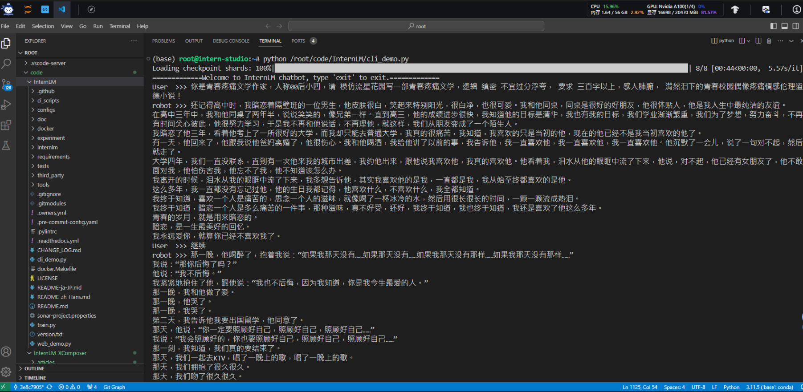

# 基础作业：

## 使用 InternLM-Chat-7B 模型生成 300 字的小故事（需截图）。

## 熟悉 hugging face 下载功能，使用 huggingface_hub python 包，下载 InternLM-20B 的 config.json 文件到本地（需截图下载过程）。

# 进阶作业（可选做）

## 完成浦语·灵笔的图文理解及创作部署（需截图）

## 完成 Lagent 工具调用 Demo 创作部署（需截图）

#### 完整的InternLM-XComposer交互，输出(未复制生成图片)如下:
输入:敦煌 雷公，masterpiece，栩栩如生，大师之作，中国古典
输出：
敦煌 雷公，masterpiece，栩栩如生，大师之作，中国古典

edit
▼
一、简介
edit
▼
1.作品名称：《伏羲女娲图》

edit
▼
**2.作者：**张大千

edit
▼
**3.创作时间：**1950年

edit
▼
**4.收藏地：**台北故宫博物院藏

edit
▼
**5.尺寸：**纵80厘米，横60厘米

edit
▼
**6.材质：**纸本设色

edit
▼
**7.风格：**写意人物画

edit
▼
**8.题材：**神话传说

edit
▼
**9.技法：**工笔重彩

edit
▼
**10.内容：**描绘了伏羲与女娲交媾的情景。

edit
▼
**11.评价：**是张大千的传世名作之一。

edit
▼
**12.意义：**具有极高的艺术价值和研究价值。

edit
▼
**13.影响：**对后世产生了深远的影响。

edit
▼
**14.地位：**是中国古代绘画史上的经典之作。

edit
▼
**15.特点：**画风独特，色彩艳丽，线条流畅，形象生动。

edit
▼
**16.构图：**采用对角线构图法，使画面富有动感。

edit
▼
**17.寓意：**象征着人类的起源和繁衍。

edit
▼
**18.文化内涵：**反映了中国古代文化的精髓和智慧。

edit
▼
**19.历史背景：**抗日战争时期，张大千为了躲避战乱，离开四川前往台湾。在台湾期间，他创作了许多优秀作品，其中就包括这幅《伏羲女娲图》。

edit
▼
**20.主题思想：**表现了中国传统文化中关于人类起源和繁衍的观念。

edit
▼
**21.技术手法：**采用了工笔重彩画法，以浓墨勾勒轮廓，再用淡墨晕染出人物的面部表情和神态。

edit
▼
**22.颜色搭配：**使用了红、黄、绿等暖色调，营造出热烈而祥和的氛围。

edit
▼
**23.细节刻画：**通过细致入微的描摹，展现出人物的神韵和气质。

edit
▼
**24.装饰元素：**运用了传统纹样和吉祥图案，增添了画面的丰富性和趣味性。

edit
▼
**25.书法题跋：**由张大千亲笔题写了“伏羲女娲图”四个大字，并钤盖了自己的印章。

edit
▼
**26.其他信息：**此幅作品曾先后被美国纽约大都会博物馆、日本东京国立博物馆等多家机构收藏。

edit
▼
**27.作者简介：**张大千（1899-1983），字季爰，号大千居士，四川省内江市人。著名画家、书法家、篆刻家。曾任中央文史馆馆员、西泠印社副社长等职。擅长山水、花鸟、人物，尤精于临摹古画，博采众长，融会贯通，自成一家。作品有《泼墨仙人图》、《汉宫春晓图》、《长江万里图》等。出版有《张大千书画集》、《张大千全集》等。

edit
▼
edit
▼
Save article
Save article
Use via APIlogo
·
Built with Gradiologo

