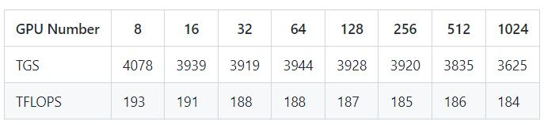
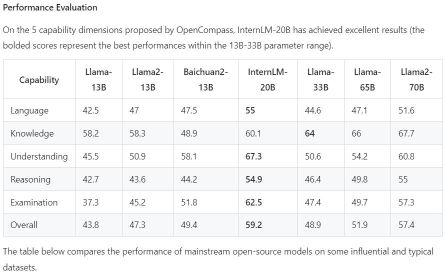
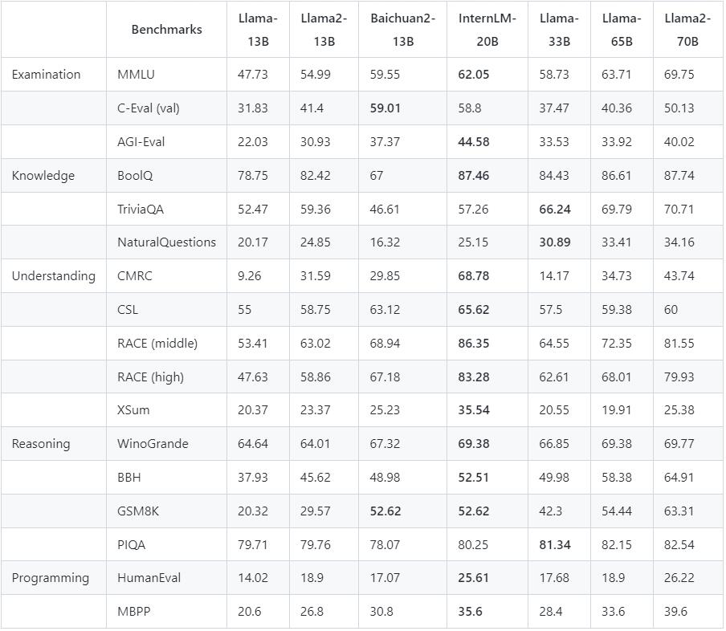
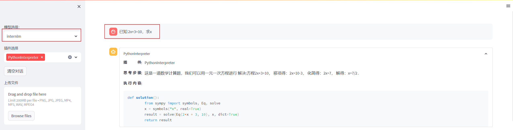
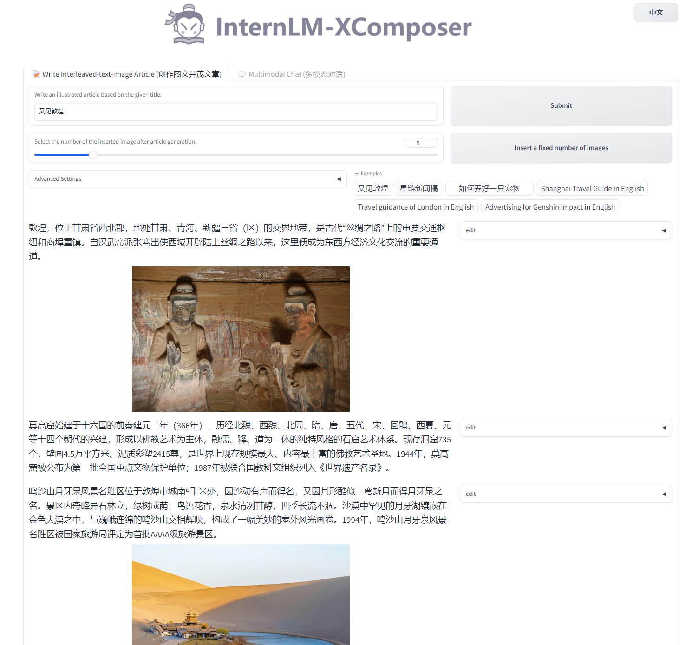
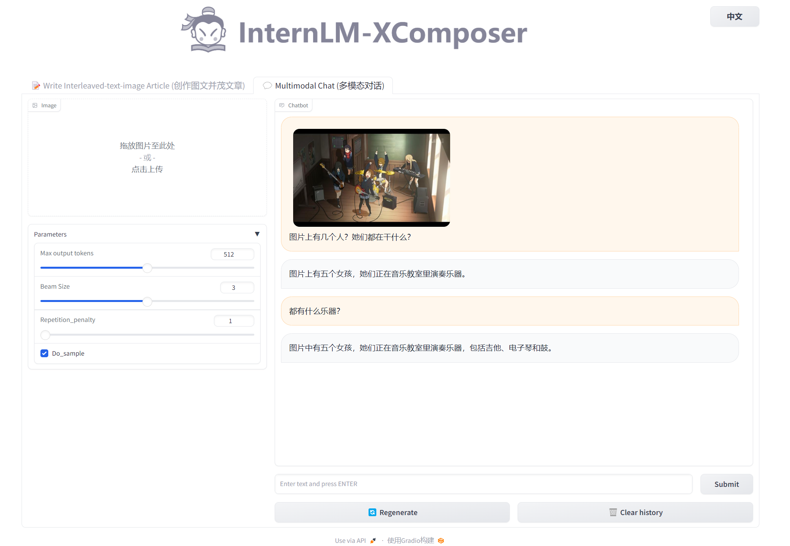

# 初见InternLM模型
## 大语言模型
大规模预训练： 当前的趋势是使用更大规模的数据和更大规模的模型进行预训练，以提高模型的语言理解和生成能力。模型如GPT-3包含了数十亿甚至上百亿的参数。
## InternLM 
InterLM 是一个轻量级训练大语言模型的框架，同时支持GPU并行，加速效率高。

    InternLM深度整合了Flash-Attention、Apex等高性能模型操作符，以提高培训效率。通过构建混合零技术，实现了计算和通信的高效重叠，在培训期间显著减少了跨节点的通信流量。InternLM支持将7B模型从8个GPU扩展到1024个GPU，千GPU规模的加速效率高达90％，培训吞吐量超过180 TFLOPS，每个GPU每秒处理超过3600个令牌的平均速度。以下表格显示了InternLM在不同配置下的可扩展性测试数据：



TGS代表每个GPU每秒处理的平均令牌数量。有关更多性能测试数据，请参阅培训性能文档以获取更多详细信息。

### InternLM-7B和InterLM-20B模型介绍。
internLM 训练了7B、chat7B、 7b-8k 和20B大语言模型，以及LagentAI智能体和浦语·灵笔多模态模型基座。

模型介绍大部分来源于官网：
https://openxlab.org.cn/models/detail/OpenLMLab/InternLM-7b

    
    InternLM-7B
    通用显卡可用的公开模型。可在20G以内的显存，使用float16推理。
    安装可以一键下载模型

安装
```shell
pip install openxlab
```
建立download.py文件，运行下载
```python
from openxlab.model import download
download(model_repo='OpenLMLab/InternLM-7b')
```
并在环境中安装运行 demo 所需要的依赖。

```shell
# 升级pip
python -m pip install --upgrade pip

pip install modelscope==1.9.5
pip install transformers==4.35.2
pip install streamlit==1.24.0
pip install sentencepiece==0.1.99
pip install accelerate==0.24.1
```
python 代码
```python
>>> from transformers import AutoTokenizer, AutoModelForCausalLM
>>> from openxlab.model import download

# Use OpenXLab SDK to download, and replace the repo name to which you want
# Fill in model_name to download the specified file
>>> download(model_repo='OpenLMLab/InternLM-chat-7b', 
# model_name=['pytorch_model-00001-of-00005.bin','pytorch_model-00002-of-00005.bin'],
output='/local/path/to/store/the/LLM/file')

# Use Transformers
>>> tokenizer = AutoTokenizer.from_pretrained("/local/path/to/store/the/LLM/file", trust_remote_code=True)
>>> model = AutoModelForCausalLM.from_pretrained("/local/path/to/store/the/LLM/file", trust_remote_code=True).cuda()
>>> model = model.eval()
>>> response, history = model.chat(tokenizer, "hello", history=[])
>>> print(response)
```

输出:


    Hello! How can I help you today?
记录聊天记录，第二次输入
```python
>>> response, history = model.chat(tokenizer, "please provide three suggestions about time management", history=history)


>>> print(response)
```
输出:

    Sure, here are three tips for effective time management:

    1. Prioritize tasks based on importance and urgency: Make a list of all your tasks and categorize them into "important and urgent," "important but not urgent," and "not important but urgent." Focus on completing the tasks in the first category before moving on to the others.
    2. Use a calendar or planner: Write down deadlines and appointments in a calendar or planner so you don't forget them. This will also help you schedule your time more effectively and avoid overbooking yourself.
    3. Minimize distractions: Try to eliminate any potential distractions when working on important tasks. Turn off notifications on your phone, close unnecessary tabs on your computer, and find a quiet place to work if possible.

    Remember, good time management skills take practice and patience. Start with small steps and gradually incorporate these habits into your daily routine.


    *限制：团队申明 尽管我们已经努力确保模型在训练过程中的安全性，并鼓励模型生成符合伦理和法律要求的文本，但由于其规模和概率生成范式，模型仍可能产生意外的输出。例如，生成的响应可能包含偏见、歧视或其他有害内容。请不要传播此类内容。我们对传播有害信息而导致的任何后果不负责任。

    InterLM-20B
    在超过2.3万亿令牌的数据集上进行了预训练，包含高质量的英文、中文和代码数据。此外，Chat版本经过了SFT（自我微调）和RLHF（强化学习来自人类反馈）训练，使其能够更好、更安全地满足用户的需求。


InternLM-20B在整体能力方面在13B参数范围内全面优于开源模型，并且在推断评估集上，其性能接近甚至超过了Llama-65B。

评估结果来自OpenCompass 20230920。

    在模型结构方面，InternLM-20B选择了更深层次的架构，深度设置为60层。这超过了传统的7B和13B模型，它们通常使用32或40层。当参数受限时，增加层数可以提高模型的整体能力。此外，与InternLM-7B相比，用于InternLM-20B的预训练数据经过了更高质量的清理，并且补充了富含知识的数据，旨在加强对理解和推理能力的支持。因此，它在理解、推理、数学和编程能力方面都表现出显著的改进，这些都测试了语言模型的技术熟练度。总体而言，InternLM-20B具有以下特点：
        出色的整体性能
        强大的实用调用能力
        支持16k上下文长度（通过推断外推）
        更好的价值对齐。
        性能评估
        根据OpenCompass提出的五个能力维度，InternLM-20B取得了优异的成绩（加粗的分数表示在13B-33B参数范围内的最佳性能）。
    模型性能


## Lagent
AI agent. 大语言模型智能体，通过大量训练调用api场景和调用接口代码，将模型训练为可调用工具的智能体。

同时智能体还具备一些特征，如计划、记忆、执行等能力。


课程有代码，可用跑通lagent,但只能调用PythonInterpreter


## 浦语·灵笔
基于interLM大语言模型研发的语言视觉多模态大模型。
以下来源于官网介绍地址：
https://openxlab.org.cn/models/detail/InternLM-xcomposer/internlm-xcomposer-7b

    InternLM-XComposer是基于InternLM的视觉-语言大型模型（VLLM），用于高级文本图像理解和合成。InternLM-XComposer具有几个吸引人的特点：

    交错的文本-图像合成：InternLM-XComposer可以轻松生成连贯且具有上下文的文章，无缝集成图像，提供更引人入胜和沉浸式的阅读体验。交错的文本-图像合成分为以下步骤：

    文本生成：根据人类提供的指令，生成长篇文本。
    图像定位和字幕：确定图像放置的最佳位置并提供图像描述。
    图像检索和选择：选择图像候选项并确定最优地与内容相辅相成的图像。
    具有丰富的多语言知识的理解：通过在广泛的多模态多语言概念上进行训练，采用精心设计的策略，增强了文本-图像理解，从而深入理解视觉内容。

    强大的性能：在包括MME Benchmark（英语）、MMBench（英语）、Seed-Bench（英语）、MMBench-CN（中文）和CCBench（中文）在内的各种视觉-语言大型模型基准测试中，InternLM-XComposer始终取得最先进的结果。

    我们发布InternLM-XComposer系列的两个版本：

    InternLM-XComposer-VL-7B 🤗 🤖 ：预训练和多任务训练的VLLM模型，以InternLM作为LLM初始化，在各种多模态基准测试中表现出色，例如MME Benchmark、MMBench Seed-Bench、CCBench和MMBench-CN。
    InternLM-XComposer-7B 🤗 🤖 ：用于交错的文本-图像合成和基于LLM的人工智能助手的进一步指导调优的VLLM。
    请参阅技术报告获取更多详细信息。

下载方式
```python
openxlab model download --model-repo 'InternLM-xcomposer/internlm-xcomposer-7b'
```
代码准备

在 `/root/code` `git clone InternLM-XComposer` 仓库的代码

```shell
cd /root/code
git clone https://gitee.com/internlm/InternLM-XComposer.git
cd /root/code/InternLM-XComposer
git checkout 3e8c79051a1356b9c388a6447867355c0634932d  # 最好保证和教程的 commit 版本一致
```

### 4.4 Demo 运行

在终端运行以下代码：

```shell
cd /root/code/InternLM-XComposer
python examples/web_demo.py  \
    --folder /root/model/Shanghai_AI_Laboratory/internlm-xcomposer-7b \
    --num_gpus 1 \
    --port 6006
```

> 这里 `num_gpus 1` 是因为InternStudio平台对于 `A100(1/4)*2` 识别仍为一张显卡。但如果有小伙伴课后使用两张 3090 来运行此 demo，仍需将 `num_gpus` 设置为 `2` 。

[**查看本教程5.2配置本地端口后**](./hello_world.md#52-配置本地端口)，将端口映射到本地。在本地浏览器输入 `http://127.0.0.1:6006` 即可。我们以`又见敦煌`为提示词，体验图文创作的功能，如下图所示：


接下来，我们可以体验一下图片理解的能力，如下所示~



